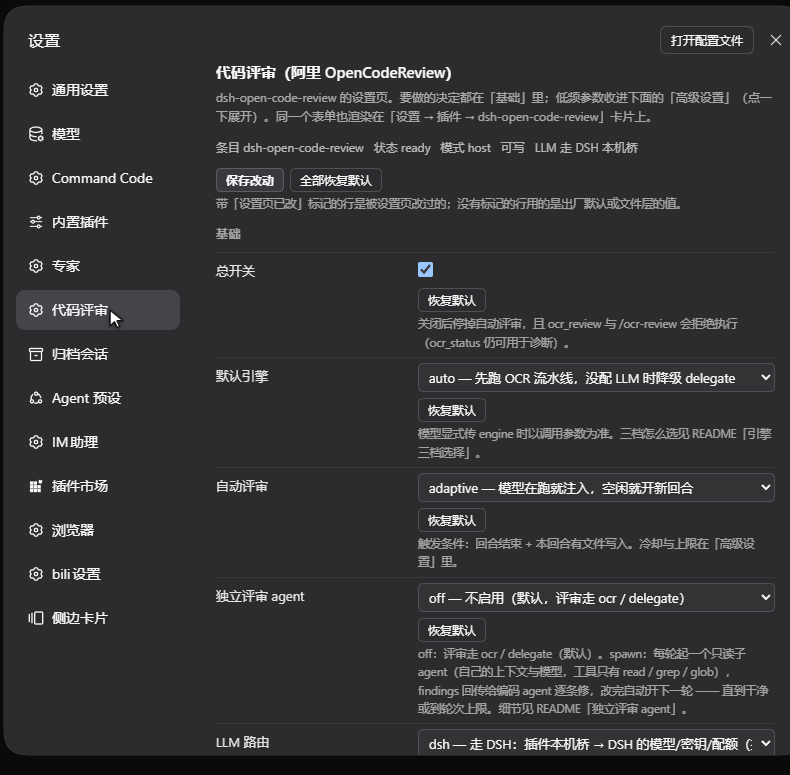
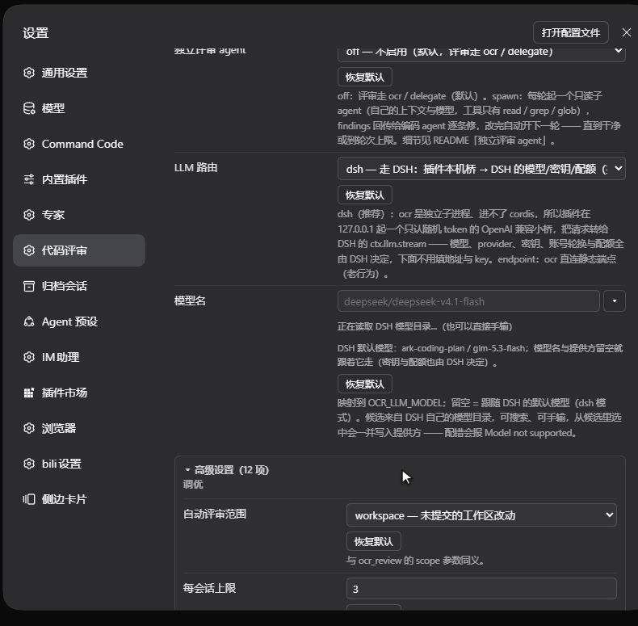

[中文](README.zh.md) · [English](README.md)

# dsh-open-code-review

[](https://github.com/xinyangGL/dsh-open-code-review/actions/workflows/ci.yml)

> 各版本（v0.3.0 → v0.8.1）的逐版加固明细与失败码见 [CHANGELOG.md](CHANGELOG.md)。

把 **阿里 OpenCodeReview（`ocr`，npm 包 `@alibaba-group/open-code-review`）** 接入 DeepSeek Harness 的第三方插件。

**四句话看懂这个插件：**

- **它做什么** —— 让模型按需跑一次代码评审：评审规格（规则 + 可审文件 + unified diff）来自 `ocr`，结论按文件逐条回来（`路径:行 [严重程度] 说明`）；也可以让它在本回合写文件后自动跑，或把「跑测试」挡在评审之后。
- **它不做什么** —— 不替你装 `ocr`；不跑你的测试；除了你配的那个 LLM 之外不往任何地方发东西；也不是 CI 的替代品：整文件扫描真机实测**每文件 176~600 秒**、约 **$0.16**。
- **要花多少钱** —— 默认（`engine = delegate`）**不多花一分钱**：评审在当前会话的上下文里完成。`engine = ocr` / `auto` 会真的调 LLM、按 tokens 计费 —— v0.8.0 起这两档是显式选择。
- **需要什么** —— Node ≥ 20、`ocr` 命令行（Windows 必须是真 `.exe`，`.cmd` 一律报 `EINVAL`）、装了本插件的 DSH、以及一个模型（`llmMode = dsh` 时用 DSH 自带的就够，什么都不用填）。

提供三条入口，全部走本机已安装的 `ocr` 可执行文件：

| 入口 | 形态 | 触发方式 |
| --- | --- | --- |
| `ocr_review` / `ocr_status` | 模型工具 | 你让模型评审时模型调用；或模型自己在改完代码后调用 |
| `/ocr-review` | 斜杠命令 | 你在输入框敲 `/ocr-review`（可带附加要求） |
| 自动评审 | 回合钩子 | 本回合有 `write`/`edit` 等文件写入，且回合即将关闭（`agent/turn-stopping`）时自动跑一次并把结果交给模型 |

引擎三档：

- **`delegate`（v0.8.0 起的出厂默认）**：**不需要 key、不花评审的 token、几秒出规格**。插件用 `ocr delegate preview` + `ocr delegate rule` 拿到「可审文件 + 按内容分组的审查规则」，再附上 `git diff`，拼成一份审查规格交给当前模型自己审（OpenCodeReview 官方为宿主 Agent 设计的 Delegation Mode）。注意它省掉的是 **ocr 内部那次 LLM 调用**，`ocr` 二进制本身仍然要装、仍然要跑。
- **`ocr`**：跑 OpenCodeReview 自己的「确定性工程 × LLM」流水线。**默认 LLM 路由是 `dsh`**：插件在本机起一个只监听 `127.0.0.1` 的小桥（随机端口 + 随机 token），把 ocr 的 `/chat/completions` 翻译成 DSH 的 `ctx.llm.stream` —— 模型、provider、密钥、账号轮换与配额全由 DSH 决定，插件配置里不用填地址和 key（见下文「LLM 路由」）。真机历史：**每个文件 176~600 秒**、按 tokens 计费（scan 单文件约 $0.16）。
- **`auto`**：先试 `ocr`，报 `no valid LLM endpoint configured` 就自动降级为 `delegate`。它和 `ocr` 一样会真的调 LLM —— v0.8.0 起这两档都改成**显式选择**：要不要为一次评审花钱，应该是你决定的，不是出厂默认替你决定的。

---

## 五分钟上手

给从没装过 `ocr` 的机器（以 Windows 为例）。预算：Node 约 1 分钟、`ocr` 约 2 分钟、装插件 + 验证约 1 分钟、第一次评审约 1 分钟。

| 步骤 | 做什么 | 判断成功的标志 |
| --- | --- | --- |
| 1 | `node -v`，需要 ≥ 20 | 打印 `v20.x` / `v22.x` / `v24.x` |
| 2 | `npm i -g @alibaba-group/open-code-review` | `opencodereview --version` 有版本号 |
| 3 | 给 `ocr` 一个模型。保持 `llmMode = dsh`（默认）时**什么都不用填** —— DSH 把自己的模型、密钥与配额借给它；想用自己的端点就选 `endpoint`，再填 `llmBaseUrl` + `llmApiKeyRef`（值是 DSH 凭据的**名字**，不是明文 key） | `ocr_status` 里 LLM 路由有值，且没有 `no valid LLM endpoint configured` |
| 4 | `dsh plugin --profile <profile> add github:xinyangGL/dsh-open-code-review`，重启 DSH | `ocr_status` 报出可执行文件 + 版本、LLM 路由、配置来源 |
| 5 | `/ocr-review`，或在写完文件的回合尾部点「启动代码审核」 | 列出逐条问题，或明确说「没有问题」 |

**先读这一段再动手**（这几条以前被文档埋得太深）：

- `ocr` 是**外部前置依赖**，插件不能替你装；而且**每一条代码路径都要跑那个二进制** —— `delegate` 省掉的只是 `ocr` 内部那次 LLM 调用，不是 `ocr` 本身。「插件没有运行时依赖」指的是 npm 包，**不包含**这个 CLI。
- Windows 上 `ocrPath` 必须指向真正的 `opencodereview.exe`；`.cmd` / `.bat` / `.ps1` 这类脚本壳会被宿主以 `EINVAL` 拒绝（宿主 spawn 不经过 shell）。
- `engine = delegate`（默认）不花评审 token、几秒出规格；`engine = ocr` / `auto` 才会跑 OCR 的 LLM 流水线：真机**每文件 176~600 秒**、按 tokens 计费（单文件约 $0.16）。**不要**这样直接接到 CI 里。
- `ocr_status` 报 `OCR_NOT_FOUND` 时，它会顺带打印当前平台的一键安装指引 —— 照那个做，别猜。

## 安装

从 GitHub 装（推荐）：

```powershell
dsh plugin --profile <profile> add github:xinyangGL/dsh-open-code-review
```

本地目录（开发态，把路径换成你自己的插件目录）：

```powershell
dsh plugin --profile <profile> add link:C:\path\to\dsh-open-code-review

# 卸载
dsh plugin --profile <profile> remove dsh-open-code-review
```

> `<profile>` 换成你的 profile 名（本机上是 `desktop`，不是 `web`）；也可以在 GUI 的插件管理里安装/启停，条目 id 为 `include:dsh-open-code-review`。

装好后 profile 会把 `cordis.patch.yml` 里声明的条目插入插件树，**工具/命令立即出现，无需重启**（profile 是热加载的）。用 `/ocr-review` 或让模型调用 `ocr_review` 验证。

### 改动后如何生效

| 改了什么 | 生效方式 |
| --- | --- |
| **设置页**里的表单值（`enabled`/`engine`/`llm.*`/`auto*`…） | **立即生效**：宿主把新值写进 `volatile` 引用并广播 `loader/volatile-update`，插件据此重读配置并启停自动评审，无需重启 |
| 外部配置文件（`<DSH_HOME>\dsh-open-code-review.json`，或 `DSH_OPEN_CODE_REVIEW_CONFIG` 指定的那个） | **立即生效**：每次调用按文件 mtime 重读，无需重启。设置页有值的键以设置页为准，本文件对它们无效（见上文「配置」）。 |
| `lib\*.js` 代码 | **需要重启 DSH**：Node 的 ESM 模块缓存会保留旧实例，实测在运行中的 profile 里禁用/启用该插件条目也不会重新导入模块；已装的 `link:` 依赖不用重装 |
| `lib\client.js`（浏览器半侧）或 `package.json` 的 `dsh.client` | **需要重启一次 DSH + 刷新页面**：客户端包是宿主启动时按包扫描的，而且「这个包不是客户端包」的判定会按包名缓存到重启为止（`dsh-client-modules` 的模块注释：*cached … until restart*），热加载不会重新扫描 |
| `cordis.patch.yml` / `package.json` | 重新执行上面的 `dsh plugin --profile <profile> add`（或在 GUI 插件管理里禁用→启用） |
| `icon.svg` / `locale\*.json`（插件卡片与清单的图标/标题/描述） | **需要重启一次 DSH**：清单展示信息在启动扫描时读取 |

> 判断「设置页有没有生效」：让模型调 `ocr_status`，第一行会写设置页可用/不可用；Host 侧也可以看 `listConfigs` 里 `include:dsh-open-code-review` 的 `status` 是否从 `absent` 变成 `schema`（`absent` = 跑的还是加 `Config` 之前的旧代码，重启即可）。

前置条件：本机已有 `ocr`（`npm i -g @alibaba-group/open-code-review`）。插件按以下顺序定位可执行文件：
外部配置文件的 `ocrPath` → `ocrCandidates` → 环境变量 `OCR_EXECUTABLE`/`OPENCODEREVIEW_BIN` → Volta/npm 常见安装位置的 `opencodereview.exe`（**优先原生 exe，避开 Windows 的 `.cmd` shim**）→ PATH 上的 `opencodereview`。

---

## 配置

**推荐用 DSH 的设置页改**，不用碰文件。两个入口通向同一份宿主数据：

- **设置 → 代码评审**：浏览器半侧往 `settings.section` 注册的独立设置页，左侧设置导航里直接可见 —— **改动都在这里做**；
- **设置 → 插件 → `dsh-open-code-review`**：这个 bundle 的卡片现在只渲染**只读摘要**（键/值两列 + 一行「完整设置：设置 → 代码评审」），不再承载可编辑表单。

设置页的结构（`lib\client.js` 的 `FIELDS`，共 **25 行**）：

| 位置 | 行数 | 字段 |
| --- | --- | --- |
| **基础**（默认展开） | 6 | 总开关 `enabled`、默认引擎 `engine`、自动评审 `autoReview`、独立评审 agent `reviewerAgent`、LLM 路由 `llmMode`、模型名 `llmModel` |
| **从属行**（随父开关出现） | 6 | `reviewerProvider` / `reviewerModel` / `reviewerRounds`（`reviewerAgent=spawn` 时）；`llmBaseUrl` / `llmProtocol` / `llmApiKeyRef`（`llmMode=endpoint` 时）。另外高级项 `llmProvider` 只在 `dsh` 路由下出现 |
| **「高级设置（13 项）」**（默认折叠，点标题展开） | 13 | 调优：`autoScope`、`autoMaxPerSession`、`autoMinReviewableFiles`、`autoMinIntervalMs`、`autoSkipSubagents`、`autoIncludeDiff`、`preTest`；运行与诊断：`audience`、`ocrPath`、`timeoutMinutes`、`progress`、`llmProvider`、`verbose` |

- 折叠区标题形如 **「高级设置（13 项）」**；折叠着的时候，如果高级项里有改了但还没保存的行，标题后面会再显示 **「N 项待保存」**。
- 被设置页改过的行带 **「设置页已改」** 标记；文件层到底提供了哪些键，要看 `ocr_status` 的 `configSource` / `configPath` / `fileValues`。
- `autoMinIntervalMs` 在表单里是档位下拉（30 秒 / 1 分钟 / 5 分钟 / 10 分钟 / 自定义…），但**存储仍是毫秒**：选「自定义…」可手填毫秒值（默认 `60000`）。
- 改完立即生效，不用重启：宿主把新值写进当前 profile 的 patch YAML（`volatile` 引用 + `loader/volatile-update` 广播）。





*真机截图（Windows 上的 DSH，侧边栏已裁掉）：上面是基础组，下面是点开「高级设置」后的样子。*

> **页面从哪来**：DSH 的插件页**不会**由宿主 schema 自动生成页面 —— 插件管理页的配置账本只从三个席位读取注册：`plugins.item`（官方插件）、`plugins.bundle.config`（bundle 自带配置）和 `plugins.row.config`（某一行自带页面）。本插件的浏览器半侧 `lib\client.js` 往 `plugins.bundle.config`（key = npm 包名 `dsh-open-code-review`）注册的是 **summary 席位的只读摘要**，往 `settings.section`（一个打开的 list 席位）注册的是独立设置页：id `open-code-review`、order 17、label「代码评审」，完整表单渲染在那里。**首次加上客户端半侧后必须重启一次 DSH 再刷新页面**（见上表）。

配置分三层，实际优先级 **设置页 > 配置文件 > 出厂默认值**（`lib\config.js` 的 `mergeLayers`：`{...DEFAULTS, ...file, ...patch}`）：

> **v0.5.8 起的一条细化**：只有「**取值不等于出厂默认值**」的设置页字段才算覆盖项。原因是 Host 会把插件 schema 实例化 —— 你没动过的字段照样带着 schema 默认值，而 `true` / `3` / `"off"` / `15` 这种默认值本身就"有意义"，无法与"用户显式设成默认值"区分。在此之前这些默认值会把整个配置文件层遮住（约 20 个键的 `config.json` 因此完全无效，真机表现为 `"timeoutMinutes": 7` 却仍按 15 跑）。**已知代价**：若你在设置页把某项显式改回出厂默认、而配置文件里写着别的值，则以配置文件为准。

| 层 | 位置 | 适合放什么 | 生效方式 |
| --- | --- | --- | --- |
| ① 设置页 | profile 的 patch YAML（由设置表单写入） | 表单里有的键（开关、引擎、LLM 端点/模型/凭据引用、自动评审参数…） | **立即生效**（宿主把新值写进 `volatile` 引用并广播 `loader/volatile-update`） |
| ② 配置文件 | 只读**一个**，取第一个存在的（`resolveConfigFile()`）：`DSH_OPEN_CODE_REVIEW_CONFIG` 指定的文件 → `<DSH_HOME>\dsh-open-code-review.json`（**推荐**，`DSH_HOME` 默认 `~\.dsh`）→ `<插件目录>\config.json`（只在源码/本地安装有意义：GitHub（git）安装的包目录在 `node_modules` 里，升级会被覆盖） | 表单没有的键：`ocrCandidates`、`autoEngine`、`maxTimeoutMinutes`、`extraArgs`、`env`、字面密钥 `llm.apiKey`、`reviewer.persona`… | **立即生效**（按 mtime 热读） |
| ③ 内置默认值 | `lib/config.js` 的 `DEFAULTS` | 出厂值（全部字段都有默认值，所以 ①② 不存在也能用） | 改代码后需重启 DSH |

字段一览（`位置` 列 = 该键在设置页里的位置；`仅文件层` = 表单里没有这一行，只能写配置文件）：

| 字段 | 默认 | 位置 | 说明 |
| --- | --- | --- | --- |
| `enabled` | `true` | 基础 | 总开关：关掉后停自动评审，`ocr_review`/`/ocr-review` 拒绝执行（`ocr_status` 仍可用于诊断） |
| `ocrPath` | `""` | 高级·运行与诊断 | `ocr` 可执行文件绝对路径；留空=自动探测 |
| `ocrCandidates` | `[]` | 仅文件层 | 额外候选路径 |
| `engine` | `"delegate"` | 基础 | `delegate`（**v0.8.0 起的出厂默认**，不调 LLM、不花 token、几秒出规格）\| `ocr` \| `auto`；只有 `ocr` 与 `auto` 会真的调 LLM。工具调用可以逐次覆盖它 |
| `autoEngine` | `""` | 仅文件层 | 自动评审用的引擎；留空=跟随 `engine` |
| `audience` | `"agent"` | 高级·运行与诊断 | 传给 `ocr --audience`：`agent`（仅摘要）/`human`（进度条） |
| `timeoutMinutes` | `15` | 高级·运行与诊断 | 单次评审超时，传给 `ocr --timeout`，同时作为插件侧硬超时（表单上限固定为出厂值 60，要更大就写文件层） |
| `maxTimeoutMinutes` | `60` | 仅文件层 | `timeoutMinutes` 的上限保护（本身还有 24 小时硬上界） |
| `extraArgs` | `[]` | 仅文件层 | 追加给 `ocr` 的原始参数 |
| `env` | `{}` | 仅文件层 | 追加/覆盖子进程环境变量（空串=删除该变量） |
| `llm.mode` | `"dsh"` | 基础 | LLM 路由：`dsh`=走 DSH（本机桥 → `ctx.llm.stream`，模型/密钥/配额都由 DSH 决定）；`endpoint`=ocr 直连下面的静态端点（老行为）。选 `endpoint` 时设置页才显示地址/协议/凭据引用三行 |
| `llm.provider` | `""` | 高级·运行与诊断（`dsh` 路由） | `dsh` 路由转发到哪个 DSH provider（如 `commandcode`）。在「模型名」下拉里选中模型时自动写入；**留空 = 跟随 DSH 默认模型**的 provider |
| `llm.model` | `""` | 基础 | → `OCR_LLM_MODEL`。**留空 = 跟随 DSH 的默认模型**（`agent-default-model`，即官方读全局默认路由的同一来源）；想固定某个模型就在「模型名」下拉里从 DSH 模型目录选（会连 provider 一起写上）。`endpoint` 路由下留空则不给 ocr 传 `OCR_LLM_MODEL`（用 ocr 自己那份全局配置） |
| `llm.baseUrl` | `https://api.commandcode.ai/provider/v1` | 从属（`endpoint`） | `endpoint` 路由才用：→ `OCR_LLM_URL`（CommandCode 的 OpenAI 兼容路由，本机实测可用） |
| `llm.protocol` | `"openai"` | 从属（`endpoint`） | `endpoint` 路由才用：→ `OCR_LLM_PROTOCOL`。CommandCode 的 DeepSeek v4.1 **只能**走 `openai`；Anthropic 协议端点用 `anthropic` |
| `llm.apiKeyRef` | `COMMANDCODE_API_KEY` | 从属（`endpoint`） | `endpoint` 路由才用：→ `OCR_LLM_TOKEN`。**这里是「凭据引用」不是密钥本身**：运行时用 `ctx.credentials.resolve()` 从 DSH 凭据库/环境变量取值 |
| `llm.apiKey` | `""` | 仅文件层 | 字面密钥（优先级高于上面的引用；不想把密钥放进 DSH 凭据库时才用，只建议写在配置文件里） |
| `auto` | `"off"` | 基础（表单键名 `autoReview`） | 自动评审开关（v0.5.0 起出厂默认 `off`）：`off` 关闭；`adaptive` 模型在跑就 `inject`、空闲就 `followup`；`inject` 只注入上下文；`followup` 直接开新回合 |
| `onDemand` | `true` | 基础（表单键名 `onDemand`） | 按需评审：每条已完成回合尾部的「启动代码审核」按钮 + runtime skill `ocr-on-demand-review`（用户说「验证/评审」时模型可自己发起） |
| `autoScope` | `"workspace"` | 高级·调优 | 自动评审的范围 |
| `autoSkipSubagents` | `true` | 高级·调优 | 子代理会话不触发自动评审 |
| `autoMaxPerSession` | `3` | 高级·调优 | 每个会话最多自动评审几次（防「改—评—改」死循环） |
| `autoMinReviewableFiles` | `1` | 高级·调优 | 可审文件数低于该值就跳过 |
| `autoMinIntervalMs` | `60000` | 高级·调优 | 两次自动评审最小间隔（毫秒；表单里是档位下拉 + 「自定义…」） |
| `autoIncludeDiff` | `true` | 高级·调优 | 自动（delegate）评审时带不带 `git diff` |
| `preTest` | `"off"` | 高级·调优 | 评审先于测试（v0.5.7 起）：`off`=不干预；`remind`=放行测试、结果回来后提醒模型去评审；`gate`=没被一次成功的 `ocr_review` 覆盖就直接跑测试会被挡回（见「评审先于测试」） |
| `reviewer.agent` | `"off"` | 基础 | 独立评审 agent：`off`=不启用（评审走 ocr/delegate）；`spawn`=每轮起一个**只读**子 agent 评审（需要宿主提供 `subagents` 服务） |
| `reviewer.provider` | `"spawn"` | 从属（`spawn`） | 子 agent 用的 provider 名（DSH 内置的是 `spawn`）；名字不存在时报 `OCR_REVIEWER_UNAVAILABLE` 并在 `notes` 里列出可用名 |
| `reviewer.model` | `""` | 从属（`spawn`） | 评审子 agent 的模型（设置页的「子 agent 模型」下拉同样来自 DSH 模型目录）；留空=跟随 provider 默认 |
| `reviewer.rounds` | `3` | 从属（`spawn`） | 一次往返最多几轮（1–10，每轮 = 一个新子会话）；到上限就交付当前结论 |
| `reviewer.persona` | `""` | 仅文件层 | 评审人格/纪律（留空=插件内置 `DEFAULT_REVIEWER_PERSONA`）；schema 里有、设置页没有这一行 |
| `includeDiffMaxBytes` | `120000` | 仅文件层 | 单次带出的 diff 上限（字符） |
| `maxIssuesInText` | `40` | 仅文件层 | 文本渲染最多列多少条问题（完整数据仍在 `issues`/`rawJson`） |
| `progress` | `true` | 高级·运行与诊断 | 评审进度：每次评审登记成宿主后台任务（kind `ocr-review`），Jobs 面板与会话内各有一条实时进度；关掉后评审照跑，只是不可见（见「评审进度」） |
| `verbose` | `false` | 高级·运行与诊断 | 打印调试日志（本机桥的日志也走它） |

### LLM 路由（`ocr` 引擎）

`ocr` 是独立 CLI 子进程，只认 `OCR_LLM_URL` / `OCR_LLM_PROTOCOL` / `OCR_LLM_MODEL` / `OCR_LLM_TOKEN` 四个环境变量（`lib\ocr-cli.js` 的 `buildEnv`）—— 它进不了 cordis，看不到 DSH 的 provider 目录、凭据库、模型目录与账号轮换。所以默认路由（`llm.mode = "dsh"`）是：

```
ocr 子进程 ──POST http://127.0.0.1:<随机端口>/v1/chat/completions──▶ 本机桥（Bearer <随机 token>）
                                                                      └─▶ ctx.llm.stream({ provider, model, … })
```

- 桥只监听 `127.0.0.1`（`BIND_HOST`）、端口随机、token 每次启动随机生成且**不落任何配置文件**；请求/响应按 OpenAI 兼容形状翻译（含 `tools` 往返与 `stream: true` 的 SSE），实现在 `lib\bridge.js`（471 行）。
- 模型与 provider 优先取设置页：`llm.model`（「模型名」下拉可搜索、候选取自 DSH 模型目录）+ `llm.provider`（选中模型时自动写入）。**两者留空就跟随 DSH 的默认模型** —— `agentDefaultModel.currentSelection()` 的 `provider` + `model`（desktop profile 里 `agent-default-model` 配的是 `commandcode / deepseek/deepseek-v4.1-flash-fast`），于是设置页一个字段都不用填。密钥、配额、429 重试与账号轮换全由 DSH 的 provider 插件负责 —— **插件里不再需要地址与 key**。
- 桥的生命周期挂在 `ctx.inject(["llm"], …)` + `ctx.effect(...)` 上（`lib\index.js:970-1005`）：宿主没有 `llm` 服务时插件照常工作，只是 `dsh` 路由回落成静态端点，`ocr_status` 会写明原因（不静默）。

#### 官方插件是怎么用 DSH 的模型的（为什么这里能不再填地址与 key）

对着 `@deepseek-ai` 自带插件逐处核对过（`app.asar` 抽取树 + `profiles\store-demo\node_modules`）：

- **DSH 没有给外部进程用的 OpenAI 兼容端点**：全树搜 `chat/completions` 零命中，它的 HTTP 面是 `/api` 上的 RPC（`dsh-api-gateway` 的 `/api/remote.mux`）。所以本机桥不是重复造轮子，而是给「只认 `OCR_LLM_*` 环境变量的独立 CLI（`ocr`）」做的一层翻译。
- 官方插件都在**进程内**直接调 `ctx.llm.stream({ provider, model, system, messages, signal })`：`dsh-agent-loop`（`preparedCall?.stream(request) ?? this.loopCtx.llm.stream(request)`）、`dsh-compaction-basic`（`for await (const chunk of ctx.llm.stream(options)) assembler.push(chunk)`）、`dsh-experimental-auto-review`（`readDecision(ctx.llm.stream(options))`）—— 桥的末端就是同一个调用。
- **可选服务**用 `ctx.get("llm")` 读、不写进插件级 `inject`（官方 `dsh-tool-subagent` / `dsh-tool-fs` / `dsh-session-reference` 都这么做），与本插件的 `ctx.inject(["llm"], …)` 一致：没有 `llm` 的 profile 里插件照常工作，只是回落静态端点。
- **路由来源**也是官方的两处：会话头 `requestHeader().config` → agent options（`dsh-tool-fs`），全局默认 = `agentDefaultModel.currentSelection()`（`dsh-agent-default-model` 服务，`buildModelCatalog` 的默认参数就是它）。本插件按「设置页 → DSH 默认模型」取值。
- 流式契约（`BlockAssembler`：`block-start` / `text-delta` / `reasoning-delta` / `tool-call-delta` / `block-end` / `usage` / `finish`，`finish.reason.kind ∈ stop | max-tokens | error | aborted`）与官方的 `readDecision` 一致，桥负责把它翻成 OpenAI 的 SSE 与 `tools` 往返。

`endpoint` 路由是保留的老行为：把「LLM 路由」切成 `endpoint`，设置页才显示地址 / 协议 / 凭据引用三行，`ocr` 直连静态端点。

实测确认过的静态端点组合（`ocr llm test` 与真实评审都通过）：

```
OCR_LLM_URL      = https://api.commandcode.ai/provider/v1
OCR_LLM_PROTOCOL = openai
OCR_LLM_MODEL    = deepseek/deepseek-v4.1-flash
OCR_LLM_TOKEN    = <COMMANDCODE_API_KEY>
```

要点与备选：

- `OCR_LLM_URL` 默认按 **Anthropic** 协议拼 `/v1/messages`；CommandCode 的 DeepSeek 系列是 OSS 模型，走 `/v1/chat/completions`，所以 `endpoint` 路由必须配 `OCR_LLM_PROTOCOL=openai`，否则报 `Model "…" is not supported on this endpoint`（`dsh` 路由由桥统一提供 `/v1/chat/completions`，不用管这条）。
- 想换成 DeepSeek 官方：`llmBaseUrl = https://api.deepseek.com/anthropic`、`llmProtocol = anthropic`、`llmModel = deepseek-chat`（该端点只认 Anthropic 协议）。
- 想换成阿里云百炼：`https://dashscope.aliyuncs.com/compatible-mode/v1` + `openai` + `qwen3-coder-plus` 之类。
- 也可以完全不动插件配置，改用 OCR 自己的全局配置（`~/.opencodereview/config.json`）：`ocr config set provider deepseek` / `ocr config set model …` / `ocr config set providers.deepseek.api_key …`；或设全局环境变量 `OCR_LLM_URL`/`OCR_LLM_TOKEN`/`OCR_LLM_MODEL`（插件里配的值优先于这些环境变量）。
- `ocr_status` 会报「LLM 路由模式」以及本地桥的 URL、请求/失败次数、最近模型与最近错误；`ocr llm providers` 可列出 ocr 内置 provider（只对 `endpoint` 路由有意义），`ocr llm test` 也由 `ocr_status` 代跑。

#### 「模型名」是可搜索下拉

配置页里的「模型名」不是死文本框：候选列表直接取自 **DSH 自己的模型目录** —— 浏览器半侧调 `ctx.remote.session.modelCatalog()`（宿主服务 `sessionController` 生成的 `session` namespace，返回 `RemoteResult` 信封 `{ ok, value: ModelCatalog }`，按提供方分组），所以候选里就有 Command Code 的整套模型（Command Code / GLM-5.3 FlashX / GPT-5.6 Luna / GPT-6 Luna / Grok 4.5 / Inkling / Inkling Small / Kimi K2.5 / K2.6 / K2.7 Code…）。

- 点输入框展开全部候选；输入即按 **名称 / id / 提供方** 过滤（空格分词，如 `kimi code`）；支持 ↑↓ 选择、回车确认、Esc 收起。
- 也允许**完全手输**任意模型名（例如换成别的端点后目录里没有的模型），选中只是帮你填。
- `dsh` 路由下输入框下方还会显示 **DSH 默认模型：provider / model**（就是目录里的 `default`），提示"模型名与提供方留空就跟着它走"。
- 目录读不出来时（旧版 DSH 没暴露该方法、`peer` 不可用等）自动退化成普通文本输入，并在下方说明原因，不会挡住配置。
- 模型目录是**运行期**事实（取决于当前有哪些提供方可路由），所以它只当候选，不当作白名单。
- 读目录要用的 `remote` / `remote.session` 声明在 `apply` 内部的**子 fiber** 上，插件本身只 `inject: ["slots"]`：cordis 的注入是全有全无（`Fiber._refresh()` 里缺任何一个服务就 INACTIVE、`apply` 根本不跑），把这两个名字写进插件级 inject，会把「没有候选列表」升级成「设置页整块消失」。子 fiber 没激活时退回不要求注入的 `ctx.get("remote")`。`test/cordis-inject.mjs` 用真 cordis 守住三种宿主形态：服务齐全（官方 `ctx.remote` 读法）/ 只差 `remote.session`（子 fiber 不激活、兜底读取口生效）/ 完全没有 `remote`（插件照常激活，只剩手输降级）。

---

## 用法

### 模型工具 `ocr_review`

```jsonc
{
  "scope": "workspace",   // workspace(默认，未提交改动) | range(from/to) | commit(commit) | scan(paths)
  "engine": "auto",       // auto | ocr | delegate
  "preview": false,       // true = 只列会审哪些文件，不调 LLM
  "effort": "high",       // low | medium | high（ocr 引擎）
  "exclude": ["**/dist/**"],
  "rulePath": "D:\\rules\\review.json",  // 自定义系统规则
  "timeoutMinutes": 15,
  "repo": "D:\\my-repo",  // 默认取当前会话工作目录
  "reviewer": true,       // true=强制独立评审 agent；false=强制 ocr/delegate；缺省按 reviewer.agent 设置
  "includeDiff": true     // delegate 模式是否附 diff
}
```

返回：`ok` / `code`（失败原因码，见下文「失败结果码」）/ `reviewableFiles` / `excludedFiles` / `issues[]` / `reviewSpec`（delegate 的规格正文）/ `reviewer`（独立评审 agent 的 provider/model/round/rounds/childId/stopReason/verdict）/ `summary` / `rawJson`（原始 JSON，最多 10 万字符）等。
`ocr_status` 用来体检：可执行文件、版本、OCR 全局配置、环境变量、`llm test` 连通性，外加 LLM 路由模式与本机桥的 URL / 请求次数 / 失败次数 / 最近模型 / 最近错误，以及独立评审 agent 的 `enabled` / `available` / `providers` / `ready` / `error` 段。

### 命令 `/ocr-review`

在输入框敲 `/ocr-review`（可在后面跟要求，例如 `/ocr-review 只审 src/ 下的改动`）→ 插件立刻给当前会话注入一段指令，让模型调用 `ocr_review` 并按结果逐条处理（真实缺陷就改，误报说明理由）。

### 按需评审（v0.5.0 起的默认方式）

默认**什么都不自动跑**。你决定要评的时候有两种入口：

1. **每条已完成回合尾部的「启动代码审核」按钮**（`conversation.chat.turnTail`，实现在 `lib/client.js`）。点一下等于对这个会话执行一次 `/ocr-review`；该会话有评审在跑时按钮变成「正在评审…」并禁用（天然防重复点击），失败会把原因显示在按钮旁边并可重试。宿主没有暴露 `remote.commands` 时按钮直接不出现，其余功能不受影响。
2. **runtime skill `ocr-on-demand-review`**（`onDemand = true` 时注册）。你说「评审一下」「验证这批改动」时，模型可以自己调 `ocr_review` 并**逐条**汇报「文件 → 行 [严重程度] 问题」。`ocr_status` 会报 `onDemand` 与 `skill.registered`，可用来确认注册成功。

按钮和手输的 `/ocr-review` 走的是宿主侧同一条斜杠命令，所以 `ocr_status` 还会报 `command: { name: "ocr-review", registered, reason }`（v0.5.4 起）。`registered` 是 `false` 就说明宿主拒绝了注册 —— 按钮与命令都不可能工作，备注里会直接点名，而不是点了没反应。

把 `onDemand` 设为 `false`（或 `enabled = false`）就只剩模型工具与 `/ocr-review` 命令：不注册 skill、没有按钮。

### 评审先于测试（`preTest`，v0.5.7 起）

「agent 改完代码会自己跑单元测试」这种标准流程里，评审应该排在测试**之前**。`preTest` 就是把这个接进标准流程的三档开关（出厂 `"off"`，什么都不干预）：

| 档 | 行为 |
| --- | --- |
| `off`（默认） | 不管测试命令 |
| `remind` | 测试照跑；这次测试**结果回来后**，给模型发一条提醒，让它补一次 `ocr_review` |
| `gate` | 这批改动还没被一次**成功**的 `ocr_review` 覆盖时，**直接跑测试会被挡回**（模型收到拒绝理由，测试根本不会执行） |

实现方式（`lib/index.js` 的 `createPreTest`）：**只注册一条** `ctx.on("tools/pre-execute", …)` 的 waterfall 监听（限定范围）。非 shell 工具一次 `SHELL_TOOLS` Set 查找后立刻 `next()`（连配置都不读）；`off` 与「不是测试命令」的调用同样直接 `next()`；`remind` 只记 pending（一律放行）；只有 `gate` 且这批改动没有成功评审覆盖时，才返回 `{ kind: "deny", reason }`。`ocr_status.preTest.mechanism` 因此只有两种取值：`"pre-execute"`（挂上了）/ `"none"`（宿主没有这个事件，或插件被 `enabled=false` 关掉）。

> ⚠️ **0.5.10 事故与合约细节**：v0.5.7 ~ v0.5.9 另外注册了**全局单调**的 `ctx.tools.guard()`，并把放行写成了返回 `""`。宿主实现是
> `guardReason(exec) { for (const guard of guards) { const reason = guard(exec); if (reason !== void 0) return reason; } }`
> —— **空字符串同样算拒绝理由**，于是每一次工具调用都被渲染成 `Error: `（理由是空的），
> `pwsh`/`read`/`glob`/浏览器/状态查询全部不可用。0.5.10 先修边界（放行返回 `undefined`）；**0.6.0
> 按 `docs/pretest-gate-safety-design.md` 的方案 B 把全局 guard 整个删掉**，只留上面那条限定范围的
> `pre-execute` 拦截器，并补上「闸门自身出错 → fail-open + 计数」：`ocr_status.preTest` 现在会报
> `failOpen` / `lastError` / `lastDecision { tool, kind, at }`（日志按错误文本变化或 30 秒限速）。
> 原则：**可选功能不能拥有「让全部工具不可用」的失败模式。**

判定与覆盖规则：

- 只认 shell 类工具（`pwsh`/`bash`/`sh`/`cmd`/`run_command` 等）里**命令开头**的常见测试入口（`npm/pnpm/yarn/bun test`、`node --test`、`npx vitest`、`vitest`/`jest`/`pytest`/`cargo test`/`go test`/`make test`…）：先按 `&&`/`||`/`;`/`|`/换行切段再逐段判定，所以 `cd lib && npm test` 算、而 `git commit -m "fix jest tests"` 这种只是提了一嘴的普通命令不算。**插件自己不执行任何命令**，只放行或拒绝。
- 覆盖状态按 agent 记（`WeakMap`）：一次 `ocr_review` 成功（`value.ok === true`）算「评过了」；**成功写文件**立刻作废；失败的评审与 `preview: true`（只列文件、没调 LLM）**都不算**评过（fail-closed）。`remind` 档挂的是同一个钩子（只记账、从不返回拒绝），否则测试结果回来时根本没有待提醒状态。`remind` 只在测试结果回来时提醒一次 —— 提醒的是模型自己去评，插件不替你跑评审。
- 累计次数会出现在 `ocr_status.preTest`（`denials` / `reminders`）与状态行里，可用来确认这档真的在起作用；同一次工具调用被询问多次只记一次。

### 自动评审（opt-in，出厂默认已关闭）

> v0.5.0 起 `auto`（设置页「自动评审」）的出厂默认是 **`off`** —— 老用户升级后不会再被自动评审打扰；想要旧行为把它改回 `adaptive`。`lib/index.js` 的两处触发点（`tools/result`、`agent/turn-stopping`）第一行就是 `if (String(cfg.auto) === "off") return;`。

只要有文件写入工具成功执行（`write`/`edit`/`apply_patch` 等），且回合即将结束，插件就会：

1. 先跑一次 `ocr review -p`（便宜、不调 LLM）确认「确实有可审改动」且改动签名与上次不同；
2. 再按 `autoEngine`/`engine` 跑正式评审；
3. 把结果交给模型——模型仍在跑就用 `inject`（下个 step 作为上下文），已空闲就用 `followup`（开新回合处理）。

每个会话最多 `autoMaxPerSession` 次，两次之间至少隔 `autoMinIntervalMs`，同样的改动签名不会重复触发。不想要就把 `auto` 设为 `"off"`。

### 独立评审 agent（opt-in）

默认 `off`：评审仍走 ocr 流水线或 delegate。把设置页的「独立评审 agent」设为 `spawn` 后，评审交给**第二个 agent** —— 它有自己的会话、上下文、人格与模型，只有只读工具：

1. 回合结束、确认有可审改动后，插件先向 ocr 要一份规格（`delegate preview` 的文件清单 + 规则正文 + `git diff`）；**范围与规则仍来自 ocr**，评审 agent 不自己决定审什么；
2. `ctx.subagents.start(provider, { prompt: 规格, outputSchema: FINDINGS_SCHEMA, toolFilter: { allow: ["read","grep","glob"] }, persona, parent: 编码 agent })` 起一个**只读**子 agent（禁止代改代码：两个 agent 抢写文件是灾难）；
3. 子 agent 按 schema 返回 `verdict`（`clean` / `issues` / `uncertain`）+ `findings[]`（`file` / `line` / `severity` = `blocker|major|minor|nit` / `message` / `evidence?` / `suggestion?` / 第 2 轮起 `stillOpen?`）；
4. 插件把 findings 注入编码 agent：「请逐条修复或说明理由（误报也要说明）；本回合结束后会自动开下一轮复审（最多 N 轮）」；
5. 编码 agent 改完 → 下一轮（新子会话，prompt 里带上上一轮 findings 要求逐条判定是修复了还是仍存在）→ 直到 `clean`、到 `reviewer.rounds` 上限、或连续 2 次失败。

安全阀：每轮都计入 `autoMaxPerSession` 与 `autoMinIntervalMs`（复用现有计数），线程闲置超过 `timeoutMinutes` 自动关闭；`clean` 关线程；同样改动签名不会重复开轮。想临时指定某一次评审，用 `ocr_review` 的 `reviewer` 参数（`true` 强制 agent，`false` 强制 ocr/delegate）。

引擎三档的选择：`ocr`（阿里流水线，最省心）→ `delegate`（当前 agent 拿 ocr 规则自审，不花钱）→ `reviewer.agent = spawn`（第二双眼睛，最贵但最像人审）。规格始终来自 ocr，所以三档可以随时切换、互不冲突。

### 评审进度（Jobs 面板 + 会话内进度行）

`progress`（默认开）把**每一次评审**（`ocr_review`、`/ocr-review`、自动评审、独立评审 agent 的各轮）在宿主里登记成一个后台任务，kind 统一是 `ocr-review`，于是同一次评审在两个地方同时可见：

| 位置 | 看到什么 |
| --- | --- |
| 会话标题栏的 **Jobs 面板**（后台任务） | 一行一条评审。标题形如 `评审 · 工作区改动 · my-repo`（自动评审是 `自动评审 · …`，区间/单提交/整文件扫描各有对应措辞）；副行是当前阶段（`运行 ocr review（超时 15 分钟；…）`、`delegate：采集 git diff…`、`独立评审 agent 第 1/3 轮…`）；展开是实时输出流（ocr 的 stderr 原样、stdout 里 JSON 之前的诊断行，外加 `[HH:MM:SS]` 阶段日志）与停止按钮 |
| 输入框上方的**会话内进度行** | 最近两条：状态词（运行中/已完成/失败/已停止/停止中…）、标题、当前阶段、已用时长；运行中的那条右侧有「停止」，**点两次**才真的停（防误触） |

细节：

- **停止**：面板或进度行的停止 → `jobs.kill()` → 插件的 `AbortController` 中止本次评审（与调用方的 `signal` 合并）→ 评审以 `OCR_ABORTED` 结束，**绝不当作通过**；20 秒内没停下就按「已停止」结算，不会一直挂在「停止中…」。
- **不刷屏**：任务挂了 `jobs.wait`，所以结算**不会**往会话里灌「后台任务完成」的唤醒消息 —— 进度是旁路，不打扰模型。
- **结算之后**：面板里的行保留（可回看阶段、输出与耗时），会话内进度行再留 60 秒后消失。
- **降级**：宿主没有 `jobs` 服务时不注册进度行（插件的 `jobs` 子 fiber 保持 pending），评审本身照跑；关掉 `progress` 只是不可见，不改变任何评审行为。
- **输出流**：完整的 `--json` 结果不进流（那一行会被跳过，否则会灌满环形缓冲），只在工具结果/自动评审载荷里（`rawJson`，最多 10 万字符）。

### 失败结果码（fail-closed）

工具结果里的 `code` 是稳定的失败原因码（`lib\review.js` 的 `CODES`，全部 `OCR_` 前缀 —— 直接搜这个词就能在测试里定位对应断言）：

| `code` | 含义 |
| --- | --- |
| `OCR_INVALID_ARGS` | 参数不合法：范围 = `workspace`/`range`/`commit`/`scan`，后三种各自缺 `from`+`to`/`commit`/`paths`；或 `from`/`to`/`commit` 以 `-` 开头（它们会被原样交给 `git`，等于让调用方注入命令行选项） |
| `OCR_DISABLED` | `enabled = false`，插件被关掉 |
| `OCR_NOT_GIT_REPO` | 目标不是 git 仓库（`range`/`commit` 范围不可用） |
| `OCR_NOT_FOUND` | 找不到 `ocr` 可执行文件 |
| `OCR_TIMEOUT` | 超过 `timeoutMinutes` |
| `OCR_ABORTED` | 调用被取消（工具调用中断、插件卸载/重载） |
| `OCR_RUN_FAILED` | `ocr` 退出码非 0 |
| `OCR_LLM_MISSING` | `ocr` 报「没有可用的 LLM 端点」（`auto` 引擎会先降级 `delegate`，只有显式 `engine: "ocr"` 才以失败告终） |
| `OCR_OUTPUT_UNPARSABLE` | `exit=0`，但输出不是 JSON / 是空串 |
| `OCR_OUTPUT_SHAPE_UNKNOWN` | `exit=0` 且是 JSON，但没有可识别的问题清单字段 |
| `OCR_DELEGATE_PREVIEW_FAILED` | `delegate` 的 `ocr delegate preview` 失败 |
| `OCR_DELEGATE_RULE_UNPARSABLE` | `delegate` 的规则 JSON 解析不出来（`reviewSpec` 仍会返回，文件清单与 diff 还能用） |
| `OCR_REVIEWER_UNAVAILABLE` | `reviewer.agent = spawn` 但拿不到评审 agent：宿主没有 `subagents` 服务、provider 名不存在、`start()` 抛错。自动档回落静态引擎并在 `notes` 里说明；显式 `reviewer: true` 直接失败（不偷偷回落） |
| `OCR_REVIEWER_FAILED` | 评审 agent 没给出可用结论：`stopReason` 不是 `completed`、`structured` 缺失或形状不合法 —— fail-closed，绝不当作通过 |
| `OCR_REVIEWER_UNCERTAIN` | 评审 agent 自己说「信息不足，无法确认」（`verdict = uncertain`）—— `ok: false`，不算通过，线程保持打开等下一轮 |

后四条（`OUTPUT_UNPARSABLE` / `OUTPUT_SHAPE_UNKNOWN` / `REVIEWER_FAILED` / `REVIEWER_UNCERTAIN`）是 **fail-closed**：退出码 0 不再等于「评审通过」。「没发现问题」必须由**带问题清单字段且为空**的 JSON 证明（`issues` / `findings` / `comments` / `problems` / `annotations` / `warnings` / `errors` / `review_comments` 任一）—— `exit=0` 但字段缺失、输出不是 JSON、或 stdout 是空的，都算失败（`ok: false`），并在 `notes` 里说清是哪一种、建议改用 `engine: "delegate"` 或复核 `rawJson`。真的没问题时结果仍是 `ok: true`、`code: ""`（`test/smoke.mjs` 有一条专门的「不误报」断言）。

`ocr_status` 的 `code` 目前只会是 `OCR_NOT_FOUND`（本地桥/端点这类原因写在 `notes` 与状态行里）。状态行首行末尾也会带上码，例如 `阿里 OpenCodeReview · engine=ocr · scope=workspace · 失败（exit=1，0s，code=OCR_RUN_FAILED）`。

插件卸载/重载是**等**在飞的评审收尾的：`dispose` 先 abort（子进程被 `terminate()`，结果标 `OCR_ABORTED`），再等这些评审真的 settle 才 resolve（`apply` 里的 effect `"在飞 ocr 评审的收尾（abort + 等待）"`），不会把半截结果当成功投递给模型。

结果码与「取消」都按**真机契约**做了硬校验（v0.3.4 一轮审计加固，见下表「加固」几条）：`signal` 已经 abort 时连子进程都不开（宿主自己会在 `spawn` 抛 `aborted before spawn`）；跑到一半才取消时子进程必须被 `terminate()`；`ocr_status.bridge` 的键集合与工具 schema 一致（多一个键宿主会在**调用期**拒收整个返回值）。这些都有断言（`test/smoke.mjs`：装了 `ocr` 225 项 / 没装 218 项）。

---

## 紧急制动（v0.7.0 起）

如果插件出问题到了「不敢让应用自己去修」的程度，或者工具面已经坏了、设置页根本打不开，有一个**不经过插件自身代码路径**的停法。两种任选：

| 方式 | 具体做法 |
| --- | --- |
| 环境变量 | 启动 DSH 时带上 `DSH_OPEN_CODE_REVIEW_DISABLE=1`（也认 `true` / `yes` / `on`）。去掉变量重启即恢复。 |
| 标记文件 | 新建 `<DSH_HOME>/dsh-open-code-review.disabled`（一般是 `~/.dsh/dsh-open-code-review.disabled`，`DSH_HOME` 可覆盖）。插件目录里放一个 `.disabled` 同样有效。删掉文件即恢复。 |

「停下来」的确切含义：`apply()` 只注册 `ocr_review` 与 `ocr_status` 两个工具，然后直接返回 —— 不注册斜杠命令、不挂任何事件监听（连 `preTest` 闸门也不挂）、不起本机 LLM 桥、不注册按需 skill、不做任何服务注入。两个工具仍然会回答，所以你能问出原因：

- `ocr_review` fail-closed 返回 `code: "OCR_DISABLED"`，摘要里说明标记在哪；
- `ocr_status` 报 `disabled: true`、`disabledBy: "env" | "file"`、标记路径，渲染文本第一行就是 `⚠️ 紧急制动已生效`，并跳过 LLM 连通性探测（停下来的插件不花钱）。

制动在运行期也会复查：DSH 跑着的时候新建标记，自动评审与闸门会在下一次事件时停手；钩子要等重启才挂回来（`ocr_status.hooks` 会如实报当前挂上了什么）。`test/killswitch-smoke.mjs` 覆盖两种来源、真值与假值，并在最后一条断言里确认它写的标记没有落进真实插件目录。

## 宿主契约（v0.7.0 起）

`ocr_status.host` 回答「这台宿主到底给没给插件要的东西」：

```json
{ "ok": true, "missing": [], "errors": [],
  "capabilities": [ { "id": "inject.jobs", "label": "Jobs 服务（ctx.jobs.start）", "surface": "host",
                      "required": false, "present": false,
                      "degrade": "没有 Jobs 面板里的进度行（会话内进度行仍在）。" } ] }
```

必需能力只有两项（`tools.register`、`subprocess.spawn`）——缺了插件等于没装；其余都是可选，每一项的 `degrade` 写了替代路径。`present: null` 表示宿主侧探测不到、只能由人在浏览器界面确认（客户端槽位）。完整表格、怎么新增一条能力、以及为什么**故意不做版本门**，见 [docs/host-contract.md](docs/host-contract.md)。

实测基线：DSH `0.2.0-rc.2` 桌面版、Node 20/22/24、`ocr 1.12.12`；这份声明同时写在 `package.json` 的 `dsh.host` 里。宿主的清单只读 `dsh.bundle` / `dsh.profile` / `dsh.client`，所以 `dsh.host` 是给人看的元数据 —— 权威答案就是上面那个运行期探测。

---

## 排障

| 现象 | 处理 |
| --- | --- |
| 插件像是死了（没有按钮、不自动评审、`ocr_review` 直接拒绝） | 先看 `ocr_status.disabled` / `disabledBy`（v0.7.0 起）：紧急制动的标记文件或 `DSH_OPEN_CODE_REVIEW_DISABLE` 生效时，插件只注册两个工具。删掉 `<DSH_HOME>/dsh-open-code-review.disabled`（或插件目录里的 `.disabled`、或那个环境变量）再重启。若 `disabled` 是 false，再看 `hooks`（实际挂上了什么）与 `host`（宿主实际提供了什么）——`preTest.mechanism` 若为 `none` 说明闸门压根没挂上 |
| 插件整个不见了：`ocr_review` / `ocr_status` 变成 unknown tool，或设置页里没有这个条目 | host fiber 加载失败。`ctx.tools.register` 会用宿主自己的 JSON Schema 子集校验 `output.schema`，违规（最常见的是 `type: ["object","null"]` 这类 **type 数组**，`anyOf` 也不支持）就抛 `JsonSchemaError`，整个插件不加载。日志里搜 `assertSupportedJsonSchema`；`node test/smoke.mjs` 现在跑同一套规则（`test/schema-subset.mjs`），改完 schema 先跑它 |
| 调用报 `tool "ocr_review" returned invalid output: "value.xxx" is not a declared property`（或 `is required` / `must be a boolean`） | **调用期**宿主还会拿 `output.schema` 校验 execute 的返回值：payload 里多了没声明的字段或少了必填字段。把字段补进 `lib\index.js` 的 `REVIEW_TOOL_OUTPUT`。`test/smoke.mjs` 的假 register 已把 execute 包住，每次工具调用的返回值都会被同一套规则检查 |
| 真实引擎跑评审时 `all N file review(s) failed`，而 `ocr_status` 的桥那行写着 `最近错误：Cannot read properties of undefined (reading 'replayState')` | 桥翻译历史消息时漏了宿主的**硬契约**：转给 `ctx.llm.stream` 的每条 `assistant` 消息都必须带 `source`（`{kind:"model",provider,model}`，`lib\bridge.js` 的 `toDshMessages` 负责补）。缺了它，宿主 `dsh-llm` 的 `forAdapter()` 一读 `message.source.replayState` 就 TypeError，且异常被吞成「上游 error」502 —— 症状是**每个文件的第 2 次请求（带 assistant 历史／工具往返）才失败**，单看桥的 stats 只有失败计数。`role: "tool"` 同理要 `source: {kind:"tool",callId}`。`test\bridge-smoke.mjs` 现在按 `hostAssistantSourceProblems()` 逐条复刻这条读取路径 |
| 设置页里找不到 `dsh-open-code-review` / 表单是空的 | 多半是**改了 `lib\*.js` 但没重启 DSH**（宿主仍缓存旧模块，`Config` 没被导出）。完全退出并重开 DSH 后再看；判据：`ocr_status` 的第一行「设置页」 |
| 插件卡片能打开，但没有配置表单 | 浏览器半侧没被加载：确认 `package.json` 里有 `dsh.client` 与 `exports["./client"]`、`lib\client.js` 存在且语法可解析（`node --check lib\client.js`），然后**重启一次 DSH** 并刷新页面（包扫描结果缓存到重启）；页面里若显示「浏览器侧没有这个条目的表单」说明 cell 已加载但条目 id 对不上 |
| 设置导航里没有「代码评审」 | 同一个表单的独立入口（`settings.section`）。它没出现说明浏览器半侧没加载；只改了 `lib\client.js` 内容时**刷新页面**即可（bundle 的 rev 取文件 mtime），但**第一次**加上/移动客户端文件要重启 DSH 才会重新扫描 |
| `无法定位 ocr 可执行文件` | 在设置页「高级设置 → ocr 可执行文件」填绝对路径，或往外部配置文件（`<DSH_HOME>\dsh-open-code-review.json`）写 `ocrPath` 指向 `opencodereview.exe`（原生 exe 优先于 `ocr.cmd`） |
| `credential "COMMANDCODE_API_KEY" 未配置` / `llm test` 报缺 key | 这是 `endpoint` 路由的问题：在设置页把「LLM 凭据引用」改成你 DSH 凭据库里已有的名字（推荐，磁盘上没有明文），或往**外部配置文件**（`<DSH_HOME>\dsh-open-code-review.json`）的 `llm.apiKey` 写一个字面密钥。仓库里只放 `config.example.json`，真实的 `config.json` 已被 `.gitignore` 忽略、也不再随包分发（`package.json` 的 `files`/`exports` 都不含它），所以写密钥不会再随提交泄露 —— 但仍要确认你自己没有把它复制进任何仓库（见「加固 v0.3.5」）。若切回 `dsh` 路由，密钥由 DSH 的 provider 配置提供，不用在这里填 |
| `OCR 未配置 LLM 端点` | 预期行为之一：`engine: "auto"` 会自动降级 `delegate`；想用 `ocr` 流水线就修好路由（`dsh` 路由看下一条，或切成 `endpoint` 填好端点/协议/模型/凭据引用）。显式 `engine: "ocr"` 时结果是失败：`code: OCR_LLM_MISSING` |
| `Model "…" is not supported on this endpoint` | `llmProtocol` 配错了：CommandCode 的 DeepSeek 系要 `openai`；走 `/v1/messages` 的 Anthropic 端点才用 `anthropic` |
| 结果里 `issues` 为空但评审成功 | 这表示返回的 JSON **确有**问题清单字段且为空（`code: ""`）= 真「未发现问题」。要核对 OCR 原始字段名与内容就读 `rawJson`；`extractIssues` 已兼容 `issues/findings/comments/…` 多种字段名 |
| `ok: false` + `code: OCR_OUTPUT_UNPARSABLE` / `OCR_OUTPUT_SHAPE_UNKNOWN` | fail-closed：`ocr` 退出码 0，但输出无法证明「评审跑过且没有问题清单」。先看 `notes` 里的原始输出摘要，必要时手工跑 `ocr review --format json`；若是新版 `ocr` 换了字段名，把新名字加进 `lib\review.js` 的 `ISSUE_KEYS`（`test/smoke.mjs` 的 `hasIssueCollection` 断言会跟着扩展），或临时用 `engine: "delegate"`（不依赖这份 JSON） |
| `ok: false` + `code: OCR_REVIEWER_UNAVAILABLE` | 先看 `ocr_status` 的 reviewer 段（`available`/`providers`/`ready`/`error`）：宿主没有 `subagents` 服务或没装 provider（本机是 `dsh-tool-subagent` 的 `spawn`）时起不了评审 agent。把「独立评审 agent」设回 `off`，或装上提供方插件；显式传 `reviewer: true` 时这是硬失败 |
| `code: OCR_REVIEWER_FAILED` | 评审 agent 没按 schema 返回（`stopReason` 是 `error`/`refusal`/`max-tokens`，或 `structured` 缺失）。诊断在 `notes`；连续 2 次会关掉这轮往返。临时绕开：`reviewer: false` 或 `engine: "ocr"` |
| `code: OCR_REVIEWER_UNCERTAIN` | 评审 agent 说信息不足：把范围/规则说清楚，或在 `reviewer.persona` 里补要求。这条**不算通过**（`ok: false`） |
| 输出被截断 | 看 `lostOutput`/`spillPath`（子进程输出超缓冲会落盘） |
| 自动评审太频繁 | 设置页调小「每会话最多自动评审次数」、调大「最小间隔」，或把「自动评审」设为 `off` |
| `ocr_status` 说「本机桥没有就绪」，状态行也显示回落 | `dsh` 路由需要宿主加载了提供 `llm` 服务的插件（本机是 `llm-commandcode` / `llm-pi-ai` 之类）。缺它就自动回落 `endpoint` 路由：要么修好 profile 里的提供方插件，要么把「LLM 路由」切成 `endpoint` 填好地址与凭据引用 |
| 设置页文案变成英文 | 界面文案走 Client locale 服务（跟随 DSH 语言）：`locale/*.json` 只放卡片标题与描述，界面文案在 `lib\client.js` 的 `TEXT_ZH`/`TEXT_EN`；没有 locale 服务或词典缺键时自动回落中文 |
| 长评审看起来卡死了，进度行几分钟没动 | v0.8.0 起长跑每 30 秒会打一次心跳，不再留一行静默：`ocr 运行中 2m10s · 还没有任何输出（超时 15 分钟；等不及可以改用 engine=delegate，几秒出规格）`；开始有输出后变成 `……最近一次输出在 4.0s 前`。「还没有任何输出」持续好几分钟，就是那几次 600 秒真机跑给我们的信号：缩小范围（`paths`/`exclude`）、加大 `timeoutMinutes`，或直接换 `engine: "delegate"` —— 规格还是同一份 ocr 规则，但几秒就回来 |
| 评审在烧 token，可我没要它花钱 | 出厂默认引擎自 v0.8.0 起是 `delegate`（不调 LLM、不花 token）；只有 `ocr` 与 `auto` 会跑 OCR 自己的流水线。**会调 LLM 的每一次运行**现在都会在第一条备注里说清（`成本提示：engine=… 真机历史 176~600s/文件、按 tokens 计费…`），失败结果末尾还会给一行 `下一步：…`，不用自己猜。若设置页或配置文件里 pin 了 `engine`，以那个为准 —— `ocr_status` 会报出实际生效的引擎与来源 |
| 插件卡片没有图标 / 标题显示成包名 | 清单读取失败：确认 `package.json` 的 `icon` 是相对路径且文件存在、`exports` 含 `"./locale/*.json"`、`locale/{zh,en}.json` 有 `meta.title/description`（`node test/smoke.mjs` 会校验这几条） |
| `DSH_OPEN_CODE_REVIEW_CONFIG` 指向的文件不存在 | v0.5.0 起不再就此停住：继续回落 `<DSH_HOME>\dsh-open-code-review.json` → 插件目录，并在 `ocr_status` 的备注里明说「指向的 … 不存在，已回落到 …」。升级前那种「静默按出厂默认跑」的情况没有了 |
| 设置页下拉框看不清（白底白字，或深色主题下深字） | v0.5.0 已修：`<select>` / `<option>` 的颜色改用宿主主题 token（`--dsw-alias-label-primary` / `--dsw-alias-bg-layer-2` / `--dsw-alias-bg-overlay`）并按当前主题声明 `color-scheme`（跟随 `theme/change` 热更新），原生下拉弹层在深浅主题下都可读。升级后若还不对，先刷新页面 |
| 结果里写着「审查 0 个文件，发现 N 条问题」 | v0.5.0 已修：文件数在 `files[]` 之后继续认 `total_files` / `reviewable_count`，最后回落到「问题里出现过的不同文件数」，摘要不再和问题清单自相矛盾 |
| 桥的 token 统计自相矛盾（`total` 大于输入+输出） | 两个原因，现在都能看出来。① **缓存**：DSH 的 `inputTokens` 已经扣掉缓存命中，而 `total` 含缓存 —— v0.5.4 起桥把 `cacheReadTokens`/`cacheWriteTokens` 一并转发（`bridge.tokens.cache_read_tokens` / `cache_write_tokens`），那行显示成 `输入 P（其中缓存命中 C · 缓存写入 W） / 输出 O`；v0.5.4 之前这部分缓存 token 直接没进统计，差值看着像凭空多出来。② 上游部分调用只报了总数：`bridge.tokens.partial` 记下这种调用次数，桥那行与 job 行会补「其中 N 次上游只报了总数」。缺失的输入/输出**不会**被编造出来 |
| 回合尾部没有「启动代码审核」按钮 | 先看 `ocr_status` 的 `onDemand`（应为 `true`）、`skill.registered` 与 `command.registered`（v0.5.4 起，`false` 说明宿主拒绝了 `/ocr-review` 注册，按钮点了也不会动）；按钮由宿主槽位 `conversation.chat.turnTail` + `remote.commands` 提供，宿主没暴露远端命令服务时按钮不出现（这是设计好的降级，不影响其它入口）。改过 `lib\client.js` 后要刷新页面 |
| 刚装好/刚重启就问 `ocr_status`，报「桥还没就绪」并回落静态端点 | v0.5.2 已修：本机桥是异步 `listen` 的，`resolveLlmRoute()` 现在会等这次启动完成（最多 2 秒）再算路由，所以**第一次**查询就走桥。慢机器上尤其明显（本机有 `ocr` 时只是因为 `ocr --version` 子进程恰好拖了几十毫秒才侥幸躲过） |
| 机器上**没装** `ocr` 时 `ocr_status` 自相矛盾（路由行写着本机桥地址，`bridge` 却是 `null`、`llmEnv` 为空）；`ocr_review` 只丢一句「设置 `ocrPath`」，可用户其实还没装 | v0.5.3 已修：与装没装 ocr 无关的字段（`bridge`/`llmEnv`/`onDemand` 备注）改到定位之前算，`ocr_status` 末尾再按最新桥统计刷新一次；定位失败时把安装指引（`installHint`）同时写进 `ocr_review` 的 notes、自动评审的投递文本和 `ocr_status.notes` |
| 改了 `config.json` 里的 `auto` / `onDemand` / `preTest`，行为没变 | v0.5.8 已修，**两个**原因：① 设置页（schema 实例）带着默认值把这些键整层遮住了（取值等于出厂默认现在不算覆盖项）；② 这三个是「装/卸监听器」的决定，以前只在启动与设置页写入时重算，文件层改动只改了值没重算决定。现在闸门只要插件没被关掉就挂着（`off` 只放行），且三个开关会在下一次工具调用/回合收尾时按文件指纹重新 sync；`ocr_status.preTest.mode` 也是现算的，不会再与文件矛盾 |
| **所有**工具都返回空内容的 `Error: `（`pwsh`、`read`、`glob`、浏览器、状态查询…） | 装的是 **0.5.7 ~ 0.5.9**：`preTest` 闸门挂在**全局** `ctx.tools.guard()` 上，而放行写成了 `return ""`。宿主的实现是 `guardReason(exec) { … if (reason !== void 0) return reason; }` —— **空字符串同样算拒绝理由**，随后管线渲染成 `Error: ${denialReason}`，于是每次工具调用都变成 `Error: `。这不是宿主升级导致的，是本插件 `""` 与 `undefined` 的边界写错。升级到 **0.5.10**（放行返回 `undefined` + 闸门自身异常 fail-open）或 **0.6.0**（连全局 guard 都删掉，只留限定范围的 `tools/pre-execute`）。卡在 0.5.7~0.5.9 的机器在应用内**修不了**（连配置文件都读不了），只能重装/升级插件再重启宿主 |
| `preTest` 设成 `gate`/`remind` 了，模型还是直接跑测试、或者明明评过了还被挡 | 看 `ocr_status.preTest`：`mode` 应该等于你设的档、`mechanism` 应该是 `pre-execute`（`none` = 宿主没有 `tools/pre-execute` 事件，或插件被 `enabled=false` 关掉）；`denials`/`reminders` 是累计计数，能确认这档真的在起作用；`failOpen`/`lastError`/`lastDecision` 用来看闸门自身有没有出错放行。覆盖状态**按 agent** 记，且**成功写文件会立刻作废**上一次评审；失败（`ok !== true`）的评审不算评过（fail-closed）。只认 shell 类工具里的常见测试入口，别的命令一律放行 |

### 加固（v0.8.1：v0.8.0 的第一次真机自审 —— 六条「承诺了却没做到」，外加 delegate 一直无视 paths）

这一版来自 `ocr_review` 扫 `lib/review.js` 的 166.2 秒、6 条发现，加上那次运行自己暴露的一条：**`delegate` 静默忽略 `paths`**。没有行为变更。

| 问题 | 现在 |
| --- | --- |
| `config.extraArgs` 直接 spread 进 argv：手工配置里写个数字 / `null` / 嵌套数组，`ctx.subprocess.spawn` 会抛 `TypeError`，整轮评审一个字都拿不到 | 统一过 `strList()` 过滤（非字符串丢弃），再加一条断言钉住 |
| JSONL 解析兜底「倒着扫、返回第一个能解析的行」= **最后一个**对象：ocr 的结果在前、尾部可能是进度对象 ⇒ 静默取错块、报 0 条问题 | 优先取「像评审结果」的对象（含 issues/files 集合），都没有才取键最多的那个 |
| `rawCount` 在去重早退**之前**自增 ⇒ 重复条目的存在会让它大于 `issues.length + dropped`（`rawCount > 0 && issues.length === 0` 这个不变式只是侥幸成立） | `rawCount` 只数去重后的真实条目，**`rawCount === issues.length + dropped` 成为硬不变量** |
| 委派规格是对**拼好的整段文本**做 `slice(0, maxBytes)`，而「## 你的任务」排在 diff **之后** ⇒ 大改动时模型收到未闭合的代码围栏、没有任何任务说明，正好在最需要它的时候失效；且 `maxBytes` 用 `text.length` 判字符，CJK 被低估 | 先算固定部分（头部 + 任务段 + 截断说明）的**字节**预算再截 diff，收尾围栏与任务段永远在；截断时写明「已按 maxBytes=N 截断…」 |
| 三份「限深递归 JSON 遍历」各写一遍（`extractFiles` / `extractIssuesDetailed` / `hasArrayField`），细节已经不同，改一处不影响另两处 | 合并成一个 `walkJson(node, keys, onArray, maxDepth)`，并有源码级断言禁止再长出第三份 |
| `delegate` 静默忽略 `paths`：`ocr delegate preview` 根本没有 `--path`（只有 `--from/--to/--commit/--exclude/--rule`），所以用户点名路径后拿到的仍是整个工作区的清单 | `runDelegate` 把 `plan.paths` 当 `only` 传下去，规格里先按路径过滤文件清单并写明「只看这些路径」；一个都没命中时**明确说**「一个都没匹配上可审文件，下面是 ocr 给的全量清单」，不假装过滤成功 |
| 两条测试从没在 CI 里跑过：`Offline test suites` 只跑五套，`killswitch-smoke` 与 `host-contract` 只在开发机上验证 | CI 现在依次跑**七套**（这两套不依赖 `ocr`，CI 等价环境里本来就全过：44 / 37） |

`test/smoke.mjs` 从 225 增到 **236** 条（没装 ocr 从 218 增到 **229**）：extraArgs 过滤、JSONL 优先结果形状与「键最多」兜底、`rawCount` 不变量、`pathMatches` 四例、30000 字符 diff + `maxBytes: 5000` 的字节/围栏/任务段断言、`truncateBytes` 的 CJK 按字节、`only` 过滤与未命中回落、`walkJson` 源码级统一、`only: plan.paths` 接线。另外 `buildOcrArgv` / `buildDelegateArgvs` 去掉了从未使用的 `config` 形参。

### 加固（v0.8.0：把默认改成不花钱的那档 —— 成本、心跳与「下一步」都摆到台面上）

这一版来自那份成熟度评估（`docs/maturity-assessment-2026-10-10.md`），不是来自事故。只改了一个默认值，外加三处「别再让用户猜」。

| 问题 | 现在 |
| --- | --- |
| 出厂默认 `engine = auto` = 「只要配了 LLM 就走最贵的那条流水线」：真机历史 **176~600 秒/文件**、按 tokens 计费（scan 单文件约 $0.16），而它曾经是**开箱默认**，用户没有任何机会拒绝 | 出厂默认改成 **`delegate`**（`lib/config.js` 的 `DEFAULTS.engine`、`pickEngine()` 兜底、工具描述、设置页顺序、EN/中文文案五处同步）。`ocr` 与 `auto` 变成**显式选择**；用户自己在配置文件里 pin 过的 `engine` 不受影响（只有出厂默认移动了） |
| 一次会长跑好几分钟，期间进度行是静的，没有任何提示能区分「在跑」和「卡死」 | 长跑每 **30 秒**打一次心跳：`ocr 运行中 2m10s · 还没有任何输出（超时 15 分钟；等不及可以改用 engine=delegate，几秒出规格）`；开始有输出后切成 `……最近一次输出在 4.0s 前`。用纯 `setInterval`（`unref()`，不用 `ctx.setInterval`），每次写进度都包 try/catch |
| 花钱这件事只在事后可见（跑完看 token 统计），启动前没有任何提示 | 任何**会真的调 LLM** 的运行，第一条备注就是成本提示：`成本提示：engine=… 走 OCR 的 LLM 流水线 —— 真机历史 176~600s/文件、按 tokens 计费（scan 单文件约 $0.16），本次给了 N 个路径…想省钱用 engine=delegate`；`delegate` 不提示（它不花钱） |
| 失败结果只给一个错误码 + 一句通用解释，用户得自己猜下一步 | 每个失败码都有 `nextStep`（`lib/review.js` 的 `NEXT_STEPS`：13 个 `CODES` + 2 个 `REVIEWER_CODES` 全覆盖，测试断言它们必须是可执行动作、且不含「请联系/无法解决/自行排查」这类空话），失败正文渲染成一行 `下一步：…`，`ocr_review` 的 schema 也带 `nextStep`（不进 required） |

`test/smoke.mjs` 从 218 增到 **225** 条（没装 ocr 从 211 增到 **218**）：新增默认引擎与 `pickEngine` 三例、码表全覆盖 + 反空话、`nextStep` 渲染、`costHint` 三例（delegate 静默 / 说明规模 / 非扫面范围）、心跳文案两例、schema 字段，以及 `startHeartbeat(` / `clockedSink(chunkSink(job), beat)` / `finally { beat.stop(); }` 的源码级接线断言。顺带修掉一条**本来就有的脆弱断言**：`auto：无 LLM 端点时降级 delegate` 那条以前靠「本机 `config.json` 恰好 pin 了 `engine: "auto"`」才成立，现在显式传 `engine: "auto"`；同理默认引擎那条改用 `normalizeConfig({})` 断言，不再读机器上的真实配置文件。

### 加固（v0.7.3：第二次真机自检 —— 六条修掉，一条明确不采纳）

v0.7.2 上真机后又审了一轮（`lib/host-contract.js` + `lib/killswitch.js`，203.6 秒、7 条）。这一版**只动这两个模块**，用户能看到的行为没有变化。

| 问题 | 现在 |
| --- | --- |
| 两条标记路径写在**同一个数组字面量**里：`join(dshHome(), …)` 一抛错，整个 `markerPaths()` 就抛，插件目录那份「DSH_HOME 都不知道在哪时」的兜底标记也一起丢掉 —— 偏偏是最需要它的时候没有它 | 走 `safePath(build)` 一条一条解析，任一条失败只记 `error`（失败的那条不进 `paths`），另一条照旧有效 |
| `killSwitchLogText` 自己再解析一次路径（两次读取之间若抛错/环境变化，日志里的位置与实际生效来源不一致），且没校验 `disabled`：未命中时仍打「本次只注册两个工具…」 | 复用 `killSwitchState()` 一起返回的 `paths`；未制动（或没传状态）直接返回空串 |
| `killSwitchText(sw = killSwitchState())` 的默认参数：调用方以为只是格式化文本，实际顺手重读环境变量 + `statSync` 磁盘 | 默认改成 `null`，状态必须显式传入（未传即返回空串） |
| `rowLabel`/`rowId` 是同一段「label/id 二选一 + 占位符」的两次实现，只差优先级、占位符字面量还重复 | 合成 `rowName(row, priority)`，避免两处兜底规则将来漂移 |
| `hostSummary` 完全信任入参字段：手工拼装/写坏的对象（`{ok:true, capabilities:[{required:true,present:false}]}`）会输出「宿主必需能力齐备；缺少 xxx」 | 有行数据时以**行数据**为准推导 `ok`/缺失项（`required === true && present !== true`），没有行数据才回落到字段 |
| `readService` 退让链用真值判定（建议改成显式判空） | **不采纳**：读不到时 `reflect.get(name, false)` 返回 `undefined`（也可能是 `null`），而服务实例恒为对象 —— falsy 正是「这一步没读到、继续退让」的信号；改成显式判空反而会在第一种读法失败时停下。理由已写进源码注释 |

`test/killswitch-smoke.mjs` 从 40 增到 **44** 条（新增：两条路径各自独立解析的源码级断言、未传状态/未制动时必须返回空串、状态里带 `paths` 且日志逐条包含它们）、`test/host-contract.mjs` 从 35 增到 **37** 条（新增：入参 `ok=true` 但行数据说必需能力缺失时以行数据为准；行缺 id/label 时不出现 `undefined`）；`test/smoke.mjs` 仍是 218（没装 ocr 211）。

### 加固（v0.7.2：v0.7.1 的第一次真机自检 —— 兜底兜住了不抛，但把 `undefined` 说给用户听）

v0.7.1 上真机后，`ocr_status.host` 终于老实说「宿主能力齐备」，紧急制动也在真机上逐条走通（写标记 → `ocr_review` 报 `OCR_DISABLED`；删标记 → 两个工具立刻回来，不用重启）。把 `lib\host-contract.js` 这些新模块再送进真机 `ocr` 审一遍（1 个文件、382 秒、3 条），加上制动走查时自己看到的一处矛盾，凑成这一版 —— 全是「兜底本身在撒谎」，行为一个都没改：

| 问题 | 现在 |
| --- | --- |
| 探针账目是模块级单例，`hookArmed()` 一律读全局 `hookStats()`：同一进程里的第二份实例（热重载、另一个 profile）会拿**别人的账目**回答自己 | 新增 `hookStatsFor(ctx)`：账目没有主人（还没挂过任何钩子）或主人就是本 ctx 时给实时账目，否则给空账目；`armHook()` 首次成功注册时记住主人 |
| `hostSummary()` 同一句里「宿主能力齐备」+「缺少 llm、jobs」自相矛盾 —— `ok` 为真只代表**必需**能力齐备 | 改成「宿主必需能力齐备；缺少 …（各有降级）」；摘要里的名字优先用能力 id（好对着清单 grep），备注里优先用中文 label |
| 行缺 `id`/`label`/`degrade` 时把字面量渲染出去：「缺少 undefined（各有降级）」「宿主没有「undefined」：undefined」（测试里就故意传了这种行） | 新增 `rowLabel()`/`rowId()` 回退（label → id → 「（未命名能力）」），`degrade` 缺失也有替代说明 |
| 被紧急制动拦住时，表头写着 `engine=auto … code=OCR_DISABLED`，可实际上一个引擎都没跑（`mkResult(null)` 的默认值） | 拒绝路径把 `engine` 置空，表头渲染成 `engine=未执行`（`REVIEW_TOOL_OUTPUT.engine` 是 string，空串合法，不加字段） |

`test/host-contract.mjs` 从 31 增到 **35** 条、`test/killswitch-smoke.mjs` 从 39 增到 **40** 条（新增：制动拒绝的表头必须是 `engine=未执行`）；`test/smoke.mjs` 仍是 218（没装 ocr 211）。默认引擎仍是 `auto`、默认仍不自动评审 —— 改默认引擎是 v0.8.0 的事。

### 加固（v0.7.1：v0.7.0 的第一次真机自检 —— 探针把宿主说错了，顺手修掉五处自己身上的毛病）

v0.7.0 刚上真机，`ocr_status.host` 就报「宿主缺少 `llm`/`jobs`/`skills`/`subagents`」——可同一份输出里明明白白写着本机桥已就绪、按需 skill 已注册。**错的是探针，不是宿主**：cordis 里访问一个没 inject 的服务会抛 `cannot get property "…" without inject`，而 `detect` 直接读 `ctx.llm`，捕获后当成「宿主没这个能力」。这一版把这条读法换成宿主自己文档里的 `ctx.reflect.get(name, false)`（**不带 inject 要求**的读法），并用 `ctx.get(name)` / 直接属性访问兜底，每一步都包 try/catch。

那一版补丁又拿去让真机 `ocr` 审了一遍（3 个文件、167 秒、13 条问题），逐条处置如下：

| 问题 | 现在 |
| --- | --- |
| 四条 `events.*` 的 `detect` 都只查 `hasFn(ctx, "on")` ⇒ 只要宿主有 `ctx.on` 就报「能力齐备」，哪怕一个钩子都没挂上（和它自己 `degrade` 里写的「不会触发」自相矛盾；紧急制动下也这样） | 事件类能力改为「宿主有这个事件 **且** 插件自己的挂载账目里真有它」（`hookArmed()` + `lib\hooks.js` 的实时账目，`probeHost(ctx, deps)` 可注入） |
| `killSwitchState()` 用 `existsSync`：它把一切错误吞成 `false`（`EACCES`/`ENOTDIR` 和「文件不存在」长得一样）⇒ 那个 `error` 字段永远是空的，诊断路径是死的；另外 `markerPaths()`（含 `dshHome()`/`join()`）在 try 之外，路径解析抛错会违背 fail-open；`out.error` 还会被后一个路径覆盖 | 改用 `statSync` + `try/catch`（`ENOENT` = 正常没标记，其余错误记 `error`），错误只记首次；路径解析包进 `resolveMarkerPaths()`（同样不抛），状态查询与日志文案共用同一份结果 |
| `lib\hooks.js` 导出的是可变 `Set`（导入方 `.add()` 就能绕过白名单）、白名单外的注册不记失败原因、`String(event)` 在 try 之外（带抛错 `toString` 的对象能破坏「永不抛」）、`handler` 不做类型校验、卸载函数**不回收**自己的账目（重复 arm/unarm 让 `ocr_status.hooks.counts` 虚高）、诊断账目无界、注册失败只悄悄记账 | 集合私有 + 导出冻结数组 `HOOK_WHITELIST` 与 `isWhitelistedHook()`；`safeEventName()` 把 `String()` 也纳入保护；`handler` 非函数即拒绝并记一笔；账目改成 `{event, active}`，卸载函数置灰 + 摘除 + 幂等调用宿主 `off`；`errors`/`blocked` 各限 50 条；新增 `setHookLogger()`，`lib\index.js` 把挂载失败接进 `log("warn", …)` |
| `hostSummary()` 假定 `host.missing` 一定是数组（`hostSummary({ok:false})` 直接 TypeError）；`present = verdict === null ? null : verdict === true` 把「服务实例」这类真值判成 false | 两处都按「入参可能是任何形状」写：残缺字段兜底、真值一律布尔化 |
| `package.json` 的 `dsh.host.capabilities` 与 `lib\host-contract.js` 的 id 词表各说各话（`tools/pre-execute` vs `events.tools/pre-execute`、`jobs` vs `inject.jobs`） | 统一成清单里的 14 个 id，并加断言：两份**必须**是同一个集合（这类「同样的话说两遍」最容易漂） |

`test/host-contract.mjs` 从 23 增到 **31** 条、`test/killswitch-smoke.mjs` 从 35 增到 **39** 条、`test/smoke.mjs` 从 212 增到 **218** 条（没装 ocr 从 205 增到 211）。

### 加固（v0.7.0：紧急制动 + 宿主契约 + 爆炸半径 —— 可选功能的失败只能影响它自己）

对着 CPO 成熟度评估逐条落地的四个小机制（不是新功能）：

| 机制 | 做了什么 |
| --- | --- |
| 应用外紧急制动 | `lib\killswitch.js`：`DSH_OPEN_CODE_REVIEW_DISABLE`（真值 `1`/`true`/`yes`/`on`）或 `<DSH_HOME>/dsh-open-code-review.disabled`（插件目录的 `.disabled` 亦可）。命中时 `apply()` 只注册 `ocr_review`/`ocr_status` 两个工具就返回，不注册命令、不挂任何事件监听、不起 LLM 桥、不注册 skill、不做服务注入；两个工具仍回答（`ocr_review` → `OCR_DISABLED`，`ocr_status` → `disabled`/`disabledBy`/标记路径 + 顶部横幅，并跳过会花钱的连通性探测）。读取完全不依赖配置，所以「配置读不出来」时也有效 |
| 宿主契约清单 + 探针 | `lib\host-contract.js`：14 条能力（必需只有 `tools.register` 与 `subprocess.spawn`），每条写清 `required`、`detect`、缺了怎么降级；`ocr_status.host` 直接回放探测结果；**故意不做版本门**（新宿主可能多能力少事件，跟着实测走） |
| 爆炸半径预算 | `lib\hooks.js` 的 `armHook()`：只有白名单里 5 个事件名能注册、每个回调包 try/catch、注册失败记账并按 30 秒限速记日志，永不抛；`safeInject()`：宿主没有 `ctx.inject`、或注入抛错都不许拖垮 `apply`。`lib\index.js` 里已无任何裸 `ctx.on(` / `ctx.inject(`（源码级断言钉住） |
| 如实报告机制 | `ocr_status.hooks`（`registered`/`counts`/`errors`/`blocked`）与 `preTest.mechanism`（只有 `pre-execute` 或 `none`）都是从**实际注册结果**读回来的，不再假设「配了就等于挂上了」 |

`test/killswitch-smoke.mjs` **39** 条（两种来源 × 真值/假值 × 命中时到底注册了什么 × 工具回答 × 结尾断言标记没写进真实插件目录）、`test/host-contract.mjs` **31** 条（逐条「缺一」验证降级 + 中毒 ctx 不炸 + 源码级登记扫描）；`test/smoke.mjs` 从 205 增到 **212** 条（没装 ocr 从 198 增到 205）。设计取舍见 [docs/host-contract.md](docs/host-contract.md) 与 [docs/pretest-gate-safety-design.md](docs/pretest-gate-safety-design.md)。（v0.7.1 把这三套加起来又加了 16 条，见上一节。）

### 加固（v0.6.2：第二次用真机 `ocr` 审自己（这次审 0.6.1 的 `lib/bridge.js`）—— 审出五条，一条真会坏事）

| 问题 | 现在 |
| --- | --- |
| 上游在连续的 `tool-call-delta` 上不带 `index` 时，兜底 index 用的是 `state.toolCalls.length`，而它每建一个 slot 就 +1 ⇒ 同一次调用的第二个 delta `find` 永远查不到上一个 slot，`name` 与 `arguments` 被拆到两个半截调用上（`openAiMessage()` 甚至把 `arguments` 填成 `"{}"`），上游会报参数错误 | 无 `index` 的 delta **复用最近一个 slot**；只有当它带着新 `name` 而最近那个 slot 已有名字时才另开一个 slot（断言：两个无 index 的连续 delta → 1 个完整调用；带新 name 的 delta → 2 个调用） |
| 模型流式吐出的思考过程（`reasoning-delta`）只累积进 `state.reasoning`，没有任何读取方 ⇒ 丢掉「模型把预算全烧在思考、正文为空」这种失败（真机见过 `finish_reason=length`、`reasoningTokens=16384`）唯一的线索 | 非流式放进 `message.reasoning_content`，流式先发一个 `delta.reasoning_content` 帧（正文帧照旧在后面） |
| `messages` 不是数组时异常直接从 `toDshMessages` 抛穿到桥的 catch：既没走 `rejectRequest()`（`rejected`/`lastReject` 漏记，与「到达桥但没转发出去都要计 rejected」不符），又让下面 `empty_messages` 分支永远走不到（注释与行为不符） | 显式校验 + `rejectRequest("invalid_messages", …)` + 400；「是数组但没有可翻译内容」仍走 `empty_messages` |
| `abortedBy()` 在外部用别的 reason 掐断时返回 `"unknown"`，却被写成「桥已关闭」⇒ 状态行的 `retrySkipReason` 指向错误原因 | 新增导出 `ABORT_SKIP_REASONS`（`timeout`/`client`/`closed`/`unknown`），未知原因也有自己的文案，且不再是嵌套三元 |
| `content` 的嵌套三元（`state.text.length > 0 ? state.text : toolCalls.length > 0 ? null : ""`）藏着「有工具调用时 content 必须为 null」的语义 | 拆成显式分支 |

`test/bridge-smoke.mjs` 从 99 增到 **103** 条；`test/smoke.mjs` 仍是 205 条（没装 ocr 198）—— 这五条都在桥内部，schema 与键集合没有变化。

### 加固（v0.6.1：第一次用真机 `ocr` 审自己的 0.6.0 —— 审出四条桥缺陷，逐条修掉）

| 问题 | 现在 |
| --- | --- |
| 累积器里的 `state.chunks` 只自增、没有任何读取方（生产代码与测试都不消费） | 连同 `state.chunks += 1` 一起删掉，并加断言禁止这个死字段回来 |
| 请求体超过上限时只 `req.pause()`：已经收进缓冲的部分仍被那个 pending Promise 持有，直到外层写完 413、`req.destroy()` 才释放（注释里担心过「悬着的请求钉住缓冲」，这里正是同一类窗口） | `chunks.length = 0` 先释放已收缓冲再 reject（413 行为不变，仍有断言钉着「客户端收到的是 413 而不是 ECONNRESET」） |
| 「到达桥但根本没转发出去」的请求（鉴权失败 / 请求体不合法 / 空 `messages` / 路由缺失）也记进 `stats.failed`，而 `requests` 不加 ⇒ 诊断里出现「已转发 0 次 · 失败 1 次」自相矛盾的数字，一次 401 还会把真正的上游失败盖掉 | 拆出 `rejected` 计数与 `lastReject`（进 `ocr_status.bridge` 与 schema 的 `required`），`failed` 只表示「转发出去但失败」；`bridgeFailureNote` 与状态行都会写「未转发即被拒 N 次 · 最近被拒：…」 |
| `stats.retrySkipReason` 只写不重置：上一次请求留下的原因会挂到下一次（后一次若是「重试过仍失败」，同一行诊断里出现错配的原因） | 每次转发前清空 `retrySkipReason`（`retrySkips` 仍是累计值），并加断言：第一次因不可重试失败留下原因、第二次成功后该字段为空且提示里不再出现「未重试原因」 |

### 加固（v0.6.0：把 preTest 从全局 guard 搬到限定范围的拦截器 —— 爆炸半径不再等于整个工具面）

| 问题 | 现在 |
| --- | --- |
| 0.5.10 只修了「`""` vs `undefined`」这个边界，**全局单调 guard 本身**还在：闸门一旦在里面出别的错（读配置、判命令、拿工具名），仍然能影响应用里的每一次工具调用 | 按 `docs/pretest-gate-safety-design.md` 的方案 B 重构：**不再注册 `ctx.tools.guard()`**，只留一条限定范围的 `ctx.on("tools/pre-execute", …)`；非 shell 工具一次 `SHELL_TOOLS` Set 查找后立刻 `next()`（连配置都不读），`off`/非测试命令直接 `next()`，`remind` 只记 pending，只有 `gate` + 无覆盖才返回 `{kind:"deny",reason}`。`ocr_status.preTest.mechanism` 收敛为 `pre-execute` / `none`（不再有 `guard`） |
| 闸门自身出错时「静默放行」看不出发生过什么，排查只能靠猜 | `preTest.failOpen` 计数 + `lastError` + `lastDecision { tool, kind, at }` 三样进 `ocr_status`（`statusText` 也会在 `failOpen > 0` 时点名「闸门自身出错放行 N 次」）；日志按错误文本变化或 30 秒限速，避免刷屏 |
| 修完还可能被下一次改动「顺手加回」全局 guard | 新增**源码级事故回归**断言：读 `lib/index.js`（剥掉注释后）检查代码里不再出现 `tools.guard(`；旧的四条 guard 语义用例（契约回归 / `off` 档 / `enabled=false` / 文件层 off→gate 端到端）全部改写成按 waterfall 语义驱动（断言 201 → 204；没装 `ocr` 时 194 → 197） |

### 加固（v0.5.10：preTest 的全局 guard 让所有工具都坏了 —— 可选功能不能拖垮整个工具面）

| 问题 | 现在 |
| --- | --- |
| **`preTest` 闸门用空字符串表示放行 ⇒ 桌面版所有工具返回 `Error: `**（v0.5.7 引入，v0.5.9 仍存在；用户侧表现是「每次工具调用都是空的 `Error: `」，连 `read`/`glob`/状态查询都不可用，会话里无法自救）。根因：`createPreTest()` 注册的是**全局** `ctx.tools.guard()`（单调、对所有工具生效），放行时 `return ""`；而宿主契约是「a returned string denies the execution」，实现 `if (reason !== void 0) return reason` 把空字符串当成拒绝理由，管线再渲染成 `text: \`Error: ${denialReason}\`` | 放行统一返回 `undefined`（两处）；guard 与 `tools/pre-execute` 两条路径都包 try/catch，**闸门自身异常一律 fail-open**（宁可漏拦一次测试，也不能让整个工具面挂掉）；新增「宿主契约回归」测试直接复刻宿主 `reason !== undefined` 判定（非测试工具必须放行、`gate` 档无覆盖的测试命令必须拒绝）（断言 200 → 201；没装 `ocr` 时 194） |
| 事故复盘与长期方案：事后才意识到「全局单调 guard」的爆炸半径 = 整个工具面 | 写进 `docs/pretest-gate-safety-design.md`：对比四套方案，推荐 v0.6.0 移除全局 guard、只留限定范围的 `tools/pre-execute` 拦截器（非 shell 工具一次 `Set` 查找后立刻 `next()`，完全不读配置），并补 `failOpen` / `lastDecision` / `lastError` 可观测性与测试矩阵 |

### 加固（v0.5.9：把 v0.5.8 的分层修复钉死，并补上第七轮自审的 9 条）

| 问题 | 现在 |
| --- | --- |
| 设置页 schema 里还剩 6 个**字面量**默认值（`enabled` / `engine` / `audience` / `autoScope` / `progress` / `verbose`）：`schemaOverrides()` 靠「值等于出厂默认 ⇒ 不算覆盖」让 `config.json` 生效，字面量一漂移就会把 v0.5.8 修好的分层**再次**弄坏（文件层整层被遮） | 全部改成引用 `DEFAULTS`，并加断言逐个比对 15 个字段（"设置页里所有带默认值的字段都引用 DEFAULTS"） |
| `runDelegate` 的四条内部诊断（规则 JSON 解析失败 / 没有可审文件 / git diff 不可用 / diff 为空）推进了「调用方传进来、又被调用方自己合并」的数组 ⇒ 直连 `engine: "delegate"` 那条链路没人合并，**用户看不到规格为什么不完整** | 改成推进 `out.notes`：手动、自动、评审 agent 三条链路都能看到 |
| `catch` 里回滚签名时 `prevSignature` 初值是空串 ⇒ 失败发生在算出新签名**之前**（路由/定位/preview）就会把上一批已评审的签名清空，同一批改动下次写入被重评一次（白花一次 LLM） | 初值改成当前签名；早失败时回滚是空操作 |
| `autoEngine` 完全没有归一（`engine` 走白名单小写化）⇒ `"Delegate "` 静默退化，外部看不出配置被忽略 | 同样收敛（去空白小写；非法值回落空串 = 跟随 `engine`，不悄悄换成别的引擎） |
| `includeDiffMaxBytes` / `maxIssuesInText` 只有「非负」没有上界 ⇒ 手误 `120000000000` 会按「几乎不限制」的字节数拼 diff / 渲染问题列表 | 各夹到 10 MiB / 2000 条；显式 `0` 仍合法（= 不带 diff / 不列问题） |
| `externalConfigPath()` 成了死代码；`preTestCountedCalls` 超上限整体 `clear()` 会重复计数；`runOcrOnce` 的局部 `num` 遮蔽了导入的 `num`；结果前缀 5 层嵌套三元 | 备注真的用 `externalConfigPath()`（「该往哪儿写」的语义）；超上限按插入顺序丢最旧一条；局部函数改名 `toFinite`；嵌套三元改成查表（断言 197 → 200；没装 `ocr` 时 193） |

### 加固（v0.5.8：配置文件其实一直没生效 + 改了「启停类开关」什么都不发生）

| 问题 | 现在 |
| --- | --- |
| **`config.json` 对「设置页里的键」几乎完全没有作用**（真机决定性实验发现，也是上一版症状的真根因）：Host 会把插件 schema 实例化，用户没动过的字段照样带着 schema 默认值（`true` / `3` / `"off"` / `15` …），而 `schemaOverrides()` 只跳过**空值** ⇒ 布尔、数字、枚举的默认值恒被当成「设置页改过」的覆盖项，把第二层（`config.json`）整层遮住。真机证据：`config.json` 里写 `"timeoutMinutes": 7`，桥打印的命令行仍是 `--timeout 15` | 规则改成「**取值恰好等于出厂默认的字段不算覆盖项**」，没动过的字段就此回落到 `config.json`（约 20 个键受益：`enabled`、`engine`、`audience`、`auto`、`onDemand`、`auto*`、`preTest`、`timeoutMinutes`、`progress`、`verbose`、`llm.mode/baseUrl/protocol/apiKeyRef`、`reviewer.agent/provider/rounds`）。已知代价（写进下文「配置」一节）：若你在设置页把某项**显式改回出厂默认**、而 `config.json` 里写着别的值，则以 `config.json` 为准 —— 这两件事在 schema 实例上无法区分 |
| **在 `config.json` 里写 `"preTest": "gate"` 完全不生效**（v0.5.7 真机复验发现）：闸门没挂上，测试命令照跑；更糟的是 `ocr_status` 仍报「preTest：off」——状态行与配置文件自相矛盾。第二个独立根因：`auto`/`onDemand`/`preTest` 三个决定是「装/卸监听器」级别的，只在 `syncAutoReviewer()` 里重新评估，而它只在启动与设置页写入（`loader/volatile-update`）时被调用；文件层改动只让**每次重读的值**变新（`cfgNow()` 是热的），没有任何东西通知插件「决定要重算」 | ① 闸门只要插件没被整个关掉就挂着（`off` 只是放行，因为 `preTestVerdict()` 每次都读当时的配置），于是 `off → gate` 立刻按新档位办事；② 新增文件层指纹 `__configStamp`（`loadConfig()` 带出），在**本来每回合就会流**的 `tools/result` 与 `agent/turn-stopping` 上比对，指纹变了才重新 sync —— 不用定时器，文件没动时几乎零开销（`configFileStamp()` 只做一次 stat）；③ `ocr_status.preTest.mode` 改成**现算**（取当次配置），不再报告上一次 sync 的结果，机制还没挂上时会明说「改动会在下一次工具调用/回合收尾时生效」 |
| 用记事本 / PowerShell 另存的 `config.json` 带 UTF-8 BOM，`JSON.parse` 直接报错 ⇒ 整份配置被当成坏文件、静默回落到出厂默认（用户以为配置生效了） | 解析前先剥掉开头的 `\uFEFF` |
| 离线测试会被自己 checkout 里的 `config.json` 弄红 | `test/smoke.mjs` 那条「preTest 出厂默认 + 三档归一」不再读插件目录的真实配置文件（改用 `DEFAULTS` + `normalizeConfig()`），所以在自己的 checkout 里 pin `preTest` 不会再让冒烟变红（断言 185 → 197；没装 `ocr` 时 190） |

### 加固（v0.5.7：评审先于测试 —— 用宿主的 guard 契约接进「跑测试之前」，并按自审逐条修掉 6 处）

| 问题 | 现在 |
| --- | --- |
| 「改完代码就该先评审再跑测试」只能靠模型自觉：插件没有任何手段在测试命令执行**之前**介入 | 新增 `preTest` 三档（出厂的 `off` 不干预；`remind` 测试照跑、结果回来提醒；`gate` 未覆盖就直接挡回，测试根本不执行）。介入点是宿主官方的 `ctx.tools.guard()` —— 契约明写「必须与顺序无关的拒绝就用它、且它是同步的」，缺这个 API 的老宿主回落到 `tools/pre-execute` waterfall（`{kind:"deny",reason}`，不拥有决定权时 `next()`）。`ocr_status.preTest.mechanism` 会显示实际走的是哪条路 |
| 「覆盖」如果只按时间或按会话记，很容易出现「评完又改了文件还放行」 | 覆盖状态按 agent 用 `WeakMap` 记：一次**成功**的 `ocr_review`（`value.ok === true`）置位，**成功写文件**立刻作废，失败的评审**不算**评过（fail-closed）；`remind` 档只在测试结果回来时提醒一次（`agent.followup`，会唤醒 agent）。插件自己**不执行任何命令**，只拦不跑 |
| 这类「拦工具」的功能一旦拦错范围，正常开发会被打断 | 判定收得很窄：先按 `&&`/`\|\|`/`;`/`\|`/换行切段，只认 shell 类工具（`SHELL_TOOLS`）里**命令开头**命中测试入口（`npm/pnpm/yarn/bun test`、`node --test`、`npx vitest`、`vitest`/`jest`/`pytest`/`cargo test`/`go test`/`make test`…）的那一种；`ocr_review` 自身与其它工具一律不受影响 |
| **`remind` 档是死代码**（自审发现，critical）：`state.pending` 只在 `preTestVerdict()` 里置位，而它只有 `gate` 档挂上钩子才会被调用 ⇒ remind 档从不挂钩子、pending 永远是 false，「放行测试 + 回来提醒」根本不会发生（旧测试靠手动调 `preTestVerdict()` 才假绿） | `sync()` 改成 `gate` 与 `remind` 都 `arm()`（remind 的判定一律返回 ""，只记账），off 才 `unarm()`；测试改成**通过真实注册的钩子**驱动 pending，钩子没挂就会红 |
| **`preview: true` 的评审能直接绕过闸门**（自审发现）：`out.ok` 对 preview 也为 true，于是模型先跑一次「只列文件、不调 LLM」的 preview 就能把覆盖状态置位 | 覆盖判定要求 `value.ok === true && value.preview !== true`；`ocr_review` 的返回值与 schema 都新增 `preview` 字段（不然宿主按 `additionalProperties:false` 会在调用期拒收） |
| 测试命令正则没锚定（自审发现）：`\b(jest\|pytest\|…)\b` 会命中命令行里任意位置的同名单词 ⇒ `git commit -m "fix jest tests"`、`grep -r pytest src/` 都会被当成测试，gate 档下误拦并刷高计数 | 改成按分隔符切段 + 逐段锚定开头（`TEST_SEGMENT_RES` + `looksLikeTestCommand()`），并加反例断言；同一次工具调用按 `callId` 去重，不再被多次询问重复计数 |
| 顺带修掉的文案/死代码：拒绝与提醒文案把入口写成「设置 → 代码审核」（真名是「代码评审」）；`preTestStats()` 导出了却没人用（`state.denials` 也从没人读） | 文案统一成「设置 → 代码评审」；`runStatus` 改走 `preTestStats()`，删掉没人读的每 agent 计数器；`lib/config.js` 的 docblock 与 schema 描述改成如实说明「优先 guard、回落 pre-execute」与「remind 只提醒模型自己去评，插件不替你跑」 |

### 加固（v0.5.6：真凭据端到端能跑了 + job 归属有断言 + 第三轮自审查出的三个桥缺陷）

| 问题 | 现在 |
| --- | --- |
| `test/e2e-llm.mjs` 根本起不来：它自建的宿主替身缺 `ctx.effect`，`apply()` 直接抛 `TypeError: ctx.effect is not a function`（所以「真凭据回归」一直只是假设、没人跑过） | 替身补 `effect`/`inject`/`get`；`inject` 故意永不回调（这个 harness 不带宿主服务，按 cordis「依赖缺失就不激活」的语义落到静态端点，正是它想要的路径） |
| 即使起来了也连不上 LLM：没有 `agentDefaultModel` 服务 ⇒ `OCR_LLM_MODEL` 为空，ocr 报 `no valid LLM endpoint configured` | 显式注入模型（`E2E_LLM_MODEL`，默认 `deepseek/deepseek-v4.1-flash-fast`）并打印出来 |
| `status-only` 会假绿：退出码用 `/可用/.test(...)` 判，而失败文案「不可用（exit=1）」里也含「可用」 | 改成 `ok === true` 且**不含**「不可用」 |
| 工作区干净时默认 `scope=workspace` 审不到任何文件，端到端只验了个空跑 | 新增 `E2E_SCOPE` / `E2E_PATHS`：`E2E_SCOPE=scan E2E_PATHS=lib/bridge.js` 走完「有文件、有问题」的完整链路 |
| job 归属只断言了「没有 `agent.id` 就不传 owner」这一个方向 | 补断言：真 `agent.id` 必须一路透传到 `jobs.start` 与 `jobs.wait`（宿主按 owner 做归属栅栏，无主 job 对所有人可见） |
| 「先吐出半截正文、再断流」（`stream ended before a terminal response event` 的另一半情形）以前被当成成功——`truncated()` 要求「没有 finish **且** 没有任何内容」，于是 ocr 拿半截评审当跑完 | 判定只看终态：`truncated() { return !state.finish; }`。依据是适配器契约（`dsh-llm-pi-ai` 的 `toStreamChunks`：正常结束必发 `usage`→`finish`，in-band error 也发 `finish`，中途断流它自己抛 `STREAM_CLOSED`），错误文案还会说明「已经收到的半截内容不算完成」 |
| 桥自己的超时与「客户端断开」混成一个 `clientGone()` 判定 ⇒ 桥超时而 ocr 还在等时既**不写响应**也**不计失败**（ocr 只能干等到自己的 `--timeout`，统计上看不出发生过什么） | 拆成 `abortedBy()` / `socketDead()` / `clientReallyGone()`：写入只看 socket，我们掐断的中止变成失败（`upstream_timeout` / `bridge_closed`），计 `stats.failed` 并记下精确的 `retrySkipReason`（「我们自己掐的，不重试」） |
| 合法 JSON 但形状不对的请求体（`null` / `123` / `[]`）能过 `JSON.parse`，随后 `body.messages` 直接把桥打崩（`TypeError: Cannot read properties of null`） | 非对象请求体一律 `400 invalid_body`（缺 `messages` 仍走原来的 `empty_messages`） |

`test/bridge-smoke.mjs` 从 89 增到 95 条（半截截断、桥超时的语义与记账、畸形请求体三组），桥的 `describe()` 里那个从没人读的 `stats.lastUsage` 一并删掉。

### 加固（v0.5.5：拿 `ocr_review` 评审自己的 diff 查出并修掉的四个桥缺陷）

这一版不是真机事故驱动的，而是**用插件自己的 `ocr scan lib/bridge.js` 评审 0.5.4 的改动**时它报出来的四条：

| 现象（升级前的旧行为） | 现在 |
| --- | --- |
| 上游以**抛出**的形式失败（`fetch failed` / `ECONNRESET` / `socket hang up` / `ETIMEDOUT` / `premature close`——全都写在 `RETRYABLE_UPSTREAM_RE` 里）时异常直接穿透重试循环：分类器根本没被问过，**永远不重试**；SSE 头已发时外层捕获只能 `res.end()`，客户端拿到「200 + 半截流」（既无 error 帧也无 `[DONE]`） | `for await (const chunk of await stream(options))` 包进 try/catch，抛出的异常归一成与 finish 块同一种 `failure`（`code: "upstream_error"`），于是和别的上游失败一样被分类、计数、重试（`bridge-smoke` 新增「抛出的瞬时错误重试一次并成功」） |
| 上游没发 finish 事件、也没有任何内容就结束（正是 `OpenAI Responses stream ended before a terminal response event` 那类截断）时 `failure()` 返回 `null` → 桥当成**空成功**（`content: ""` + `finish_reason: "stop"`）交给 ocr，一轮评审静默丢掉 | accumulator 新增 `truncated()`；这种流判成 `code: "upstream_truncated"` 失败（文案命中重试白名单，因此也走重试），不再谎报成功 |
| 模型同时给正文和工具调用时，流式分支（`openAiStreamFrames`）只发工具帧、把 `state.text` 丢掉，而非流式 `openAiMessage()` 会把它放进 `message.content` —— 同一份 accumulator 两条路径不一致 | 正文帧改成两个分支都先发，流式与非流式一致 |
| `openAiMessage(model)` 的 `model` 形参从未使用，看起来像「模型是响应契约的一部分」 | 去掉该形参 |
| 客户端断开后仍然往 `res` 写：`controller.abort()` 只是**请求**上游停下，上游若不理 signal（或复用同一条流）会照常跑完，于是往已销毁的 socket 写 → `res.write` 同步抛 `ERR_STREAM_DESTROYED`，而 `res.on("error")` 只吞 'error' **事件**，异常逃出请求回调就是未处理异常（足以杀掉宿主进程）。另外「我方中止」的三句文案在 abort 处和 `SELF_ABORT_RE` 里各写一份，只靠子串巧合命中 | 所有写入过 `clientGone()`（`signal.aborted` / `writableEnded` / `destroyed`）闸门并包 try/catch（`sendJson` 也防御），中止后到达的结果直接丢弃、**不再误记成上游失败**；三句文案收进 `SELF_ABORT_MESSAGES`，正则由它们生成（`bridge-smoke` 新增漂移守卫：谁改文案忘了正则就红） |

`test/bridge-smoke.mjs` 从 84 增到 89 条：旧的「抛异常 → 500」期望改成「→ 502 + `upstream_error`」并补它的重试记账，另加「抛出的可重试错误第二次成功（200 + `retries: 1`）」「静默截断（`fakeStream([])` → `upstream_truncated`、`failed: 1`、`retries: 1`）」「上游忽略 abort 照常跑完（不写死 socket、不误记失败）」「`SELF_ABORT_MESSAGES` 与正则不漂移」。同一轮自审还顺手做了测试卫生：路径从 `BRIDGE_COMPLETIONS_PATH` 派生、`assistant.source` 断言不再接受 `null`、删掉没人用的 `log()` 辅助、两条从未 `close()` 的桥补上关闭。正常路径行为不变。

### 加固（v0.5.4：token 口径与命令注册可自查）

| 现象（升级前的旧行为） | 现在 |
| --- | --- |
| `ocr_status` 报「累计 tokens 452422（输入 41305 / 输出 73581）」—— 41305+73581=114886，中间凭空少 337536，而 `partial` 是 0（不是「上游只报总数」那种情形） | 真因是缓存：DSH 的 `inputTokens` 已经扣掉缓存命中，`total` 却含缓存。桥现在多认 `cacheReadTokens`/`cacheWriteTokens`（以及 OpenAI 风格的 `cache_read_tokens` / `cachedTokens` / `prompt_cache_hit_tokens`），带出 `cache_read_tokens`/`cache_write_tokens` 与 `prompt_tokens_details.cached_tokens`，文案统一成 `累计 tokens T（输入 P（其中缓存命中 C · 缓存写入 W） / 输出 O）`（`describeTokens()` 同时供状态行与 job 行使用），`total` 仍大于各部分之和时补「另有 U tokens 未分类」。schema 同步（`usage` 增两个可选缓存字段、`bridge.tokens` 六键都进 required） |
| `/ocr-review` 命令是否注册成功没人验证：宿主升级、`definitionId` 撞车都会让 `ctx.commands.register()` 静默失败，而回合尾部按钮、手输命令、设置页都假设它在 | 注册结果记进模块状态，`ocr_status` 新增 `command: { name, registered, reason }`（进了顶层 required 与 `statusText`），失败时备注直接点名「回合尾部按钮与手输命令都会失败，请报给插件作者」，并在 `log` 里 warn 一条 |

### 加固（v0.5.3：没装 ocr 的机器也能跑通 CI）

| 现象（升级前的旧行为） | 现在 |
| --- | --- |
| CI（裸 clone + node，没有 npm 全局包）上 24 条断言失败：真链路用例直接 FAIL，job/进度渲染、`render`、自动档注入跟着级联红 | 离线用例按环境换期望值：装了 `ocr` 验真链路，没装就验「定位失败」的诊断路径（`OCR_NOT_FOUND` + 安装指引 + 不误报成功），断言数恒定（现在 197 / 没装 190；v0.5.3 当时是 161 / 155）。CI 现在只用 `node` 就能跑到结尾 |
| 没装 ocr 时真实调用「在定位那一步就返回」，于是面板/进度行一条 job 都没有 —— 以前这被当成「进度功能坏了」 | 这是有意的 **fail-closed**：绝不显示一条假装在评审的进度行。用例改成守住不变量（登记的 job 都不停在 `running`、id/kind/label 统一、输出环有带时间戳的日志行） |

### 加固（v0.5.2：桥就绪等待）

| 现象（升级前的旧行为） | 现在 |
| --- | --- |
| 插件刚加载完就调 `ocr_status` / `ocr_review`：桥还在 `listen`，于是判成「桥没就绪」→ 静默回落 `llm.baseUrl` 静态端点（凭据要按 `llmApiKeyRef` 解析，dsh 模式下通常是没配的） | `resolveLlmRoute()` 开头 `await waitForBridge()`：桥启动是异步的，等它（最多 `BRIDGE_READY_WAIT_MS = 2000`）再决定路由；`ocr_status` 的 `llmRoute`/`llmEndpoint`/`bridge` 三个字段因此始终自洽 |
| 离线测试用 `setTimeout(150)` 赌桥的 `listen` 完成 | 改成**立刻**查一次就断言桥可用（钉住等待逻辑），两处裸 `bridge.url` 的 `fetch` 加了守卫，桥真的起不来时是 FAIL 而不是把整个套件崩掉（CI 之前就崩在 `test/smoke.mjs:675`）。`test/smoke.mjs` 装了 `ocr` 时 197 项、没装时 190 项（v0.5.2 当时是 161 / 155；少掉的 7 条是真端到端 `ocr llm test`，其余用例两种环境都跑、只是期望值不同） |

### 加固（v0.5.0：按需评审 + 逐条列问题 + 配置收敛）

| 现象（升级前的旧行为） | 现在 |
| --- | --- |
| 每轮只要有文件改动就被自动评审 | 出厂默认 `auto`（设置页「自动评审」）改成 `off`：不自动注入、不开新回合、不烧配额。要评审就点回合尾部的「启动代码审核」按钮、让模型按 `ocr-on-demand-review` 这个 skill 自己发起，或直接 `/ocr-review`。想要旧行为把「自动评审」改回 `adaptive` |
| 结果只说「发现 N 条问题」，还得自己翻 `rawJson` 找位置 | 结果正文、job 行、投递消息都按文件分组逐条列 `- 行号或行区间 [severity] 问题（规则）`，并带上 ocr 给的 `endLine`/`column`/`rule`/`suggestion`；job 行只列前 12 条再补「其余 N 条见评审结果」 |
| 「审查 0 个文件，发现 6 条问题」 | 文件数只认 `files[]` 时，摘要没有文件清单就会算成 0。现在依次回落 `total_files` / `reviewable_count` / 问题里出现过的文件数，不再自相矛盾 |
| 设置页下拉框在浅色主题下白底白字、深色主题下深字 | 颜色改用宿主主题 token 并按当前主题声明 `color-scheme`（跟随 `theme/change`），原生弹层在深浅主题下都可读 |
| `DSH_OPEN_CODE_REVIEW_CONFIG` 写错路径 → 静默按出厂默认跑 | 回落链 continue：env 不存在 → `<DSH_HOME>` → 插件目录，`ocr_status` 备注明说回落到了哪里（`__configSourceHint`）；`externalConfigPath()` 不再把 env 路径当成 home 候选 |
| 三层配置的嵌套块（`llm` / `reviewer` / `env`）能塞进坏类型 | `mergeLayers` 改成先深合并、再 `normalizeConfig`：枚举去空白小写并校验白名单、字符串 trim、`reviewer.rounds` 1–10、数值夹进设置页同一组上下界（大于上界夹住，小于下界回落默认；`autoMaxPerSession: 0` 这种显式 0 仍合法） |
| 桥的 token 统计 `total` ≠ 输入+输出 | `accumulateUsage` 多记一个 `partial`（上游只报总数的次数），`describe().tokens` / `ocr_review.usage` / `ocr_status` 文案与 schema 同步，缺口如实说明而不是编数字 |
| 改配置文件后偶尔不重读 | 热读缓存键从 `mtime + size` 改成 `mtime + ctime + size`（内容变了但大小与 mtime 被保持住的情况也能发现） |

### 加固（v0.3.4：一轮针对「稳定性/健壮性」的审计与修复）

| 现象（升级前的旧行为） | 现在 |
| --- | --- |
| `ocr_status` 说 `ocrPath` 指向 `.cmd`/`.bat`/`.ps1` 被拒绝 | 硬拒并说明原因：Node 24 起 `spawn` 对批处理 shim 直接抛 `EINVAL`（子进程起不来还会被当成「执行失败」）。请指向原生的 `opencodereview.exe`（第 50 行那条探测顺序也是这个道理） |
| 明明改了代码却不再自动评审 | 旧实现把「上次评审的签名」在评审**前**就推进了，一次瞬时失败（超时/网络/桥没起来）之后就认为这批改动已评过，且失败是静默的。现在签名在评审**成功**后才推进，同批改动失败会重试（`AUTO_RETRY_LIMIT = 2`） |
| Jobs 面板里有一条评审一直转圈不结束 | 旧实现「打满轮次上限」的分支先登记 job 再 `return`，从不结算。现在会结算成 `failed` + `code: OCR_REVIEWER_UNCERTAIN`，摘要写明「已达轮次上限（N 轮），仍有 M 条未确认的问题」 |
| 点了「停止」之后上游模型还在烧配额 | 旧桥不监听客户端断连。现在请求 `aborted`/连接被关会中止上游 `ctx.llm.stream`（`req.aborted` / `res` 的 `close` 两条路径）；桥的 `close()` 最多等 2s 宽限，然后关闭所有在飞连接 |
| 设置页/`config.json` 里把开关写成 `"false"`、次数写成负数 | 旧实现把 `"false"` 当**真**（真值判断只看存在性），负数直接变成负超时（等于关掉硬超时、评审能挂到天荒地老）。现在 `loadConfig` 会归一：`"false"/"0"/"off"` → `false`，非法数字/负数回落到默认值（`timeoutMinutes` 默认 15，也夹在 `maxTimeoutMinutes` 之内） |
| 评审结果形状不认识却报「未发现问题」 | fail-closed 补齐：`exit=0` 但没有可识别的问题清单字段 → `OCR_OUTPUT_SHAPE_UNKNOWN`（`test/smoke.mjs` 有 7 种坏形状的回归表）；混合清单（一部分解析不出来）也会在 `notes` 里写明「N 条无法解析」 |

### 加固（v0.3.5：一次真机 `ocr scan` 评审本身的发现）

这轮改动全部来自「用本插件评审它自己的 `lib\config.js`」的真实输出（`ocr scan`，175.9s，6 条问题），逐条修掉：

| 现象（升级前的旧行为） | 现在 |
| --- | --- |
| 文档/注释引导把**明文密钥**写进 `config.json` | 旧版 `config.json` 在仓库里受版本控制、且随插件包分发（`package.json` 的 `files`/`exports` 都含 `./config.json`），写进去会随提交与分发泄露。现在：`config.json` 已被 `.gitignore` 忽略、从索引里移除（`git rm --cached`）、也不再进 `files`/`exports`，仓库里放 `config.example.json` 模板；模板与文档都明确密钥首选 `llm.apiKeyRef`（指向 DSH 凭据库，磁盘无明文），`llm.apiKey` 只是最后手段，且推荐写 `<DSH_HOME>\dsh-open-code-review.json` 而不是包目录 |
| 设置页 / `config.json` / 默认值三层里，某层的 `env`、`extraArgs`、`ocrCandidates` 被静默丢掉 | 旧实现只叠加 `file` 层（`patch.env` 直接丢、`extraArgs`/`ocrCandidates` 只取文件层）。现在三层按「设置页 > 外部配置文件 > 默认值」叠加，后两者走 `stringList()`（取上层第一个真数组、过滤空串） |
| `includeDiffMaxBytes` / `maxIssuesInText` 显式写 `0` 却被当成「没配」 | 旧实现末尾有 `\|\| DEFAULTS.x`，把 `0`（本意是「不带 diff」/「正文不列问题」）吃掉，和同组其它计数项（`0` 合法）不一致。现在显式 `0` 保留 |
| 同一批阈值在 `DEFAULTS` 和 `buildSchema()` 里各写一份，改一处忘一处 | `buildSchema()` 的 6 个 `.default(...)`（`autoMaxPerSession`/`autoMinReviewableFiles`/`autoMinIntervalMs`/`autoSkipSubagents`/`autoIncludeDiff`/`timeoutMinutes`）与 `timeoutMinutes` 的上界都改成引用 `DEFAULTS`；`lib\review.js` 里 `maxTimeoutMinutes` 的回落值也从硬编码 `45` 改成 `DEFAULTS.maxTimeoutMinutes`（此前同一语义有三个数字：60 / 60 / 45） |
| 配置文件写坏了（JSON 语法错）却毫无提示 | 仍然 fail-safe 按出厂默认跑，但每次文件变化会在宿主日志里留一行：`[dsh-open-code-review] <解析出来的路径> 解析失败，本次按出厂默认运行：<原因>`（热读有 mtime/size 短路，所以只喊一次，不会刷屏） |

### 加固（v0.3.6：修好 v0.3.5 之后再评一次自己的 `lib\config.js`）

第二轮真机 `ocr scan`（229.6s，5 条问题；上一轮那 6 条已全部消失）逐条修掉：

| 现象（升级前的旧行为） | 现在 |
| --- | --- |
| `timeoutMinutes: 999` 时「ocr 收到 `--timeout 60`、插件侧却按 999 分钟才算超时」 | 同一个分钟数只有一个来源：`normalizeConfig` 把 `maxTimeoutMinutes` 夹在 24h 内、`timeoutMinutes` 再夹在它之内（`MAX_TIMEOUT_MINUTES`）；`lib\config.js` 新增 `timeoutMsOf()` 统一换算毫秒，Jobs 行截止、评审 agent 的空闲上限、桥的上游超时都走它；Jobs 行的截止改成 `plan.timeoutMs`（= 分钟 + 60s 宽限，`lib\review.js:118`），不再读 `cfg` 的裸分钟数（否则面板行会先于 run 自己的硬超时触发） |
| 手写 `config.json` 里 `"timeoutMinutes": "20"`（数字带引号）静默回落默认 | `countLike()` 改走新的 `toFiniteNumber()`：数字字符串也认（空串/纯空白/非数字仍回落默认），与 `boolLike()` 的宽容度一致 |
| `maxTimeoutMinutes` 调到 120 也不放宽设置页的上限 | 上界本身有 24h 硬上界（`MAX_TIMEOUT_MINUTES`），而设置页那张表的上限固定为出厂值（schema 常量）——描述里直接写明「要更大的值请直接写 `config.json`」 |
| `DEFAULT_REVIEWER_ROUNDS` 在 `lib\config.js` 与 `lib\reviewer.js` 各有定义 | 单一来源在 `lib\config.js`（`buildSchema()` 的默认值也用它），`lib\reviewer.js` 只 `export { … }` 转发 |
| `endpoint` 模式下换了供应商却忘改地址 → 凭据被发到出厂那个第三方地址 | `ocr_status` 与评审正文的「LLM 端点」行在地址仍等于出厂默认值时点名：`…（出厂默认地址，换供应商时记得同步改 llm.baseUrl，否则凭据会发到旧地址）`（`endpointDisplay()`） |
| `mergeLayers` 的注释宣称设置页也能给 `env`/`extraArgs`/`ocrCandidates` | 注释改成实际情况：这三个键不在设置页 schema 里，生产路径上 patch 侧只有 `llm`/`reviewer`/开关类字段；`[]` 与 `undefined` 无法区分，所以空数组 = 显式清空 |

### 加固（v0.3.7：真机「上游流被截断 → 整份扫描白跑」）

v0.3.6 上线后的第一次真机复验（`ocr scan lib\config.js`）连续两次失败：两次**都不是插件回归**，而是暴露了两个新问题——上游把流截断时，桥把这一次失败原样丢给 ocr，于是 ocr 报「整个文件的扫描失败」并打印一句误导人的通用提示（600.4s / 413.8s 各白跑一次）：

| 现象（升级前的旧行为） | 现在 |
| --- | --- |
| 上游偶发 `OpenAI Responses stream ended before a terminal response event`（本例是 DSH 默认模型换成 `ark-coding-plan/glm-5.3-flash` 之后），桥只转发一次 → ocr 报 `all 1 file scan(s) failed — check your LLM configuration and API key`，整份扫描白跑 | 桥对**上游瞬时故障**自动重试一次（`MAX_UPSTREAM_ATTEMPTS = 2`；`isRetryableUpstreamFailure()` 认「流被截断 / ECONNRESET / fetch failed / 429 / 502-504 / 限流 / 过载」，**不认**我方主动 abort——客户端断开、桥的上游超时、桥关闭都直接放弃）。这么重试是安全的：桥本来就是「先把上游流攒完、再一次性写给客户端」（`createAccumulator` + `openAiStreamFrames`），失败时客户端一个字节都没收到，所以 JSON 与 SSE 两条路径都不会重复内容 |
| 失败时只见 ocr 那句「check your LLM configuration and API key」，看不出真因，容易被引到密钥上 | 评审失败时若桥侧有失败记录，notes 里追加一行桥侧真因（`bridgeFailureNote()`）：`本机桥：已转发 21 次 · 失败 2 次 · 上游重试 1 次 · 最近错误：OpenAI Responses stream ended before a terminal response event（模型 glm-5.3-flash） —— ocr 打印的「check your LLM configuration and API key」是它的通用提示，未必是密钥问题。`（最小往返自检 `ocr_status{checkLlm:true}` 当时是成功的，正好印证「通路没坏、只是长请求偶发被截断」） |
| 重试是「悄悄发生」的，账目不透明 | 桥的 `stats.retries` 单独计数（重试成功**不算** `failed`），`ocr_status` 的桥那行在有重试时补 `上游重试 N 次`，工具 schema 同步声明 `retries`（返回值多一个未声明字段会被宿主在调用期拒收） |

```
dsh-open-code-review/
├─ package.json          # dsh.bundle.patch 指向 cordis.patch.yml；dsh.client 声明浏览器半侧；icon 指向 icon.svg
├─ icon.svg              # 插件管理卡片/详情里的图标（相对路径，≤256KiB）
├─ locale/
│  ├─ zh.json            # 卡片标题与描述（meta.title/description）：不加载插件也要可读
│  └─ en.json            # 同上，英文
├─ cordis.patch.yml      # 插入 profile（本机为 desktop）插件树的条目
├─ config.example.json   # 配置模板（复制到 <DSH_HOME>\dsh-open-code-review.json 再改；真实的 config.json 已被 .gitignore 忽略、不进仓库也不进包）
├─ lib/
│  ├─ index.js           # 插件入口：schemastery Config + 工具/命令注册 + 自动评审钩子 + 本机桥接线 + 独立评审 agent 编排（runReviewerReview / 轮次往返 / subagents 子注入）+ 评审进度接线（openReviewJob / finishReviewJob / chunkSink）
│  ├─ reviewer.js        # 评审 agent：规格提示词、findings schema 与解析、线程与轮次（纯逻辑；subagents 运行时由调用方注入）
│  ├─ bridge.js          # 本机 LLM 桥：OpenAI 兼容 /v1/chat/completions ⇄ ctx.llm.stream（含宿主硬契约：assistant 消息补 source{kind:"model",provider,model}、tool 消息补 source{kind:"tool",callId}）
│  ├─ client.js          # 浏览器半侧：注册 plugins.bundle.config + settings.section + 会话内进度行（conversation.input.dock），渲染设置表单（`FIELDS` 25 行 = 基础 6 + 随父开关出现的从属 6 行 + 「高级设置」折叠 13 项；bundle 卡片只渲染只读摘要），文案走 Client locale
│  ├─ config.js          # 三层配置合并、schemaOverrides（读 volatile 引用）
│  ├─ killswitch.js      # 紧急制动（v0.7.0）：环境变量 / 标记文件两条不依赖配置的「存在即禁用」判定
│  ├─ hooks.js           # 爆炸半径（v0.7.0）：armHook（事件名白名单 + try/catch + 注册失败记账，永不抛）、safeInject、hookStats
│  ├─ host-contract.js   # 宿主契约清单与探针（v0.7.0）：14 条能力的 required/detect/degrade + probeHost，喂给 ocr_status.host
│  ├─ job.js             # 评审进度：把每次评审登记成 background job（进度行/输出流/停止/结算），宿主没有 jobs 服务时整条链路降级成空操作
│  ├─ ocr-cli.js         # 可执行文件探测、受管子进程（含实时输出回调）、LLM 环境变量映射（本机桥或静态端点）、git diff
│  └─ review.js          # 参数规范化、命令行拼装、JSON 解析、文本渲染
└─ test/
   ├─ smoke.mjs          # 离线冒烟（假 ctx + 罐头/真 ocr，装了 ocr 236 项 / 没装 229 项断言：缺 ocr 的用例换成验「定位失败」的诊断路径，所以裸 clone 的 CI 也全绿；含工具 schema 子集 + 返回值校验、结果码、fail-closed（7 种坏形状）、取消（abort 前不 spawn / 跑到一半必 terminate）、生命周期收尾、独立评审 agent 全路径、评审进度与 job 归属（owner 透传到 start/wait）、逐条列问题与 0 文件口径、配置分层与默认值单一来源、三层配置先深合并再归一 + 上下界/枚举收敛、超时同源与上限夹取、桥就绪等待、清单/图标/locale/DSH 默认模型校验、评审先于测试 preTest（测试命令识别含误报反例 / 三档 / 只走 pre-execute 一条机制 / 闸门异常 fail-open 计数与 lastDecision / 覆盖状态随评审与写文件变化 / 源码级断言不再注册全局 tools.guard / 文件层指纹与启停同步）、v0.7.0 紧急制动与爆炸半径（armHook 白名单内外、注册抛错不冒泡、no ctx.on 记账、源码级认定无裸 ctx.on 且 armHook 出现 7 次、ocr_status.hooks 四件套、schema 声明 disabled/disabledBy/hooks/host）、v0.8.0 默认引擎与成本/心跳（默认 delegate 且不读机器上的真实配置、pickEngine 三例、每个失败码都有可执行的 nextStep、costHint 对 delegate 静默、心跳区分「还没输出」与「刚有输出」、nextStep 进 schema、心跳接线源码级断言））：node test/smoke.mjs
   ├─ schema-subset.mjs  # 宿主 schema 子集与返回值的校验器（smoke.mjs 共用；register 时查 schema、调用时查 execute 的返回值 —— 这两处都曾让真机炸过）
   ├─ job-smoke.mjs      # 评审进度冒烟（假 jobs registry，51 项断言：登记/进度行/输出流/停止→取消/结算幂等/轮次上限也会结算/没有 jobs 时降级）：node test/job-smoke.mjs
   ├─ reviewer-smoke.mjs # 评审 agent 纯逻辑冒烟（罐头 subagents，45 项断言：提示词/结构化解析/线程轮次/失败与超时/超时会 abort 掉在飞的子 agent）：node test/reviewer-smoke.mjs
   ├─ bridge-smoke.mjs   # 本机桥冒烟（假 llm 流 + 真 ocr 子进程，103 项断言，含「assistant 消息必须带 model source」「tool 消息必须带 tool_call_id」「客户端断连要中止上游且不再写死 socket」「上游流被截断要自动重试一次且不重复写内容」「静默截断判失败」「半截正文也算截断」「桥自己的超时会给客户端交代并计入统计」「畸形请求体 → 400 invalid_body」「抛出的瞬时错误也要重试」这些真机/自审回归，以及 token 只报总数时的 partial 计数、v0.6.1 的 rejected/lastReject 与 retrySkipReason 逐请求重置、v0.6.2 的无 index 工具调用合并与 reasoning_content）：node test/bridge-smoke.mjs
   ├─ client-smoke.mjs   # 浏览器半侧冒烟（迷你 React + 假 configForms/remote/locale，208 项断言，含会话内进度行、回合尾部「启动代码审核」按钮与它的四种失败/禁用路径、设置页基础组与「高级设置」折叠、下拉主题 token 与档位预设、preTest 三档下拉）：node test/client-smoke.mjs
   ├─ cordis-inject.mjs  # 真 cordis 回归（26 项断言，守住「服务齐全（含 jobs）/只差 remote.session/完全没有 remote」三种宿主形态）：node test/cordis-inject.mjs
   │                     #   取不到 cordis 就跳过：不打印"全部通过"、退出码 2（跳过 ≠ 通过）；OCR_TEST_CORDIS 可指 main 文件或目录
   │                     #   CI 里不再容忍这个跳过：工作流临时装上游 cordis + cosmokit（--no-save）并把 OCR_TEST_CORDIS 指到真 main 文件，跳过即失败
   ├─ killswitch-smoke.mjs # 紧急制动冒烟（44 项断言：环境变量各真值/假值、两种标记路径、命中时 apply 只注册两个工具、两个工具的回答、ocr_status 顶部横幅与跳过探测；标记只写临时 DSH_HOME，最后断言真实插件目录没有被写脏；v0.7.1 起还覆盖「标记是目录也算命中」与 statSync/ENOENT 的源码级守卫；v0.7.2 起断言拒绝表头写的是 engine=未执行）：node test/killswitch-smoke.mjs
   └─ host-contract.mjs  # 宿主契约冒烟（37 项断言：14 条能力逐条「缺一」验证降级、ctx 为 null/被写坏/访问器抛错时不炸、源码级断言 lib/index.js 用到的扩展点都登记在清单里；v0.7.1 起还覆盖「服务只藏在 ctx.reflect.get(name,false) 后面也认」与「有 ctx.on 但没挂上钩子时四条事件能力必须报缺失」；v0.7.2 起还覆盖「文案里不出现字面量 undefined」「账目按 ctx 取」）：node test/host-contract.mjs
   └─ e2e-llm.mjs        # 端到端（真凭据 + 真 LLM，会花钱/耗时）：node test/e2e-llm.mjs [仓库路径] [status-only]
                          #   status-only 只做连通性自检（免费）；E2E_LLM_MODEL 换模型；
                          #   E2E_SCOPE=scan E2E_PATHS=lib/bridge.js 可在工作区干净时也真审出问题
```

## 已知限制

- 自动评审依赖 `agent/turn-stopping` 事件；若宿主未加载提供该事件的插件则自动档不触发（工具与命令不受影响）。
- `ocr review` 的 JSON 结构在不同版本间可能变化，插件对 `issues[]` 做了宽松提取，但**永远保留 `rawJson`** 供核对。
- 自动评审与「模型自己调用 `ocr_review`」可能重复；签名判重只针对自动档。
- 非 git 仓库 / 空仓库下 `workspace` 范围没有可审改动（`preview` 会给出 0 个文件）。
- `dsh` 路由要求宿主加载了提供 `llm` 服务的插件（本机是 `llm-commandcode` / `llm-pi-ai` 之类）；缺它时自动回落 `endpoint` 路由，行为与老版本一致。
- 本机桥是明文 HTTP + Bearer 随机 token，只绑定 `127.0.0.1`、只活在本进程内，token 通过子进程环境变量交给 `ocr`（同机信任模型，不做 TLS/签名；断言见 `test/smoke.mjs` 的「只监听 127.0.0.1」与 `test/bridge-smoke.mjs`）。
- `ocr` 退出码 0 **不等于**评审通过：输出 JSON 里缺少可识别的问题清单字段（或不是 JSON / 是空串）时结果算失败（`OCR_OUTPUT_UNPARSABLE` / `OCR_OUTPUT_SHAPE_UNKNOWN`），免得「评审其实没跑成」被当成「没问题」。
- 插件卸载/重载会先 abort 在飞的评审（子进程 `terminate()`，结果标 `OCR_ABORTED`）并等它们 settle，所以 `dispose` 可能要等子进程收尾。
- 结果码是稳定契约（`OCR_*`）：`REVIEW_TOOL_OUTPUT` / `STATUS_TOOL_OUTPUT` 的枚举说明、`lib\review.js` 的 `CODES`、`lib\reviewer.js` 的 `REVIEWER_CODES` 与 `test/smoke.mjs` 的码表断言四处同步。
- 独立评审 agent 需要宿主加载提供 `subagents` 服务的插件（本机是 `dsh-tool-subagent` 带的内置 `spawn` provider）。缺它时自动档回落静态引擎并在 `notes` 说明，显式 `reviewer: true` 以 `OCR_REVIEWER_UNAVAILABLE` 失败。
- 结构化输出（`outputSchema`）只在一次性的 `ctx.subagents.start()` 上可用，所以**每轮都是一个新的子会话**：线程记忆（上一轮 findings / `stillOpen`）由插件写进 prompt。子会话会出现在子代理侧栏，并计入 `autoMaxPerSession`。
- 评审子会话自己的回合结束不会再触发自动评审（`autoSkipSubagents` 挡住递归）；`uncertain` 不算通过，`clean` 才关线程。
