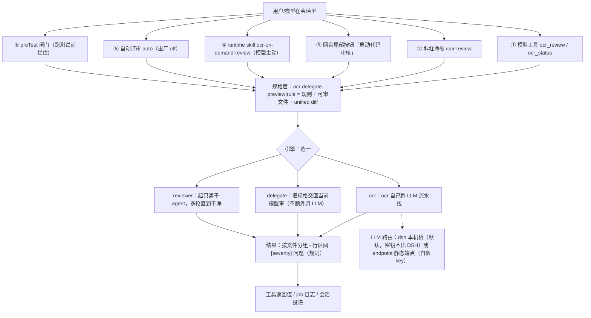

# dsh-open-code-review 产品机制梳理与成熟度评估

**评估对象**：`dsh-open-code-review` v0.6.1（MIT，xinyangGL，https://github.com/xinyangGL/dsh-open-code-review ）
**评估日期**：2026-10-10
**核验方式**：直接读工作区仓库 + 实跑全部测试 + 查 git 时间线 + 查本机 DSH 安装/市场状态。文中"已核验"均指评估者亲自跑过或读过源文件。

---

## 一、机制梳理

### 1.1 触发 → 链路 → 结果 → 成本

| 入口 | 触发成本 | 单次运行成本 | 用户体感 | 出厂状态 |
|---|---|---|---|---|
| ① `ocr_review` / `ocr_status` | 0（模型按需调） | ocr 档全文件 4~6 min、≈$0.16；delegate 档≈0 | 明确、可预期 | 开 |
| ② `/ocr-review` | 1 次输入 | 同上 | 明确 | 开 |
| ③ 回合尾部按钮 | 1 次点击 | 同上 | 最省心——只有点了才花钱 | 开（`onDemand=true`） |
| ④ runtime skill | 0（占一点上下文） | 同上 | 模型自己决定，用户可能无感 | 开 |
| ⑤ 自动评审 auto | 每回合都评估 | 同上 × 次数上限 | 最打扰，所以默认关 | off（v0.5.0 起） |
| ⑥ preTest 闸门 | 0（拦截时才可见） | 触发时等于强制先审 | 挡路感最强 | off |

**一句话总结**：插件把"评审"从一个人工动作，改造成了一个可被模型调用的工具 + 三个可挂载的时机（回合尾部人工点、回合自然结束自动、跑测试前拦截），三种引擎只是"谁来执行同一份 ocr 规格"的切换开关。成本结构的关键是：**规格层由 ocr 产出、执行层可替换**——这才是这个产品真正的架构判断，也是它比"再写一个 review 提示词"值钱的地方。

### 1.2 多余的部分

| 项 | 为什么多余 | 建议 |
|---|---|---|
| `zprobe.mjs`(7行) / `zprobe2.mjs`(23行) / `zprobe3.mjs`(26行) | 三个一次性探测脚本被提交进仓库（已核验） | 删除或移出仓库 |
| reviewer 档的"线程记忆靠插件写 prompt" | 结构化输出只在一次性 `ctx.subagents.start()` 上可用，每轮都是新子会话 | 定位收窄为"高风险改动的深度审" |
| auto 档（4 档）与 onDemand 并存 | 默认已 off，代码路径仍需维护 | 降级为实验档，文档不与主推路径并列 |
| 界面文案硬编码在 `lib/client.js` 的 `TEXT_ZH/TEXT_EN`，`locale/*.json` 只放卡片标题/描述（en.json 629B / zh.json 561B，已核验） | 改文案要改 1552 行的代码文件 | 全数据化，或明确承认"只支持中英" |
| `preTest=gate` 的强推语气 | 首次使用就拦测试命令，最易劝退 | gate 只在用户成功评审过一次后再推荐 |

### 1.3 缺失的部分

| # | 缺口 | 已核验的证据 | 后果 |
|---|---|---|---|
| G1 | 没有运行时 kill switch | 配置层只有 env → `~/.dsh/…` → 插件目录 → 设置页；事故中配置读不了 | 插件级故障 = 用户无法自救 |
| G2 | 没有宿主/ocr 兼容性声明 | `package.json` 无 dsh 版本范围；依赖宿主内部契约（`tools/pre-execute` 语义、`message.source.replayState`） | 宿主升级后静默坏掉 |
| G3 | 没有灰度/金丝雀纪律 | 33 commit 全在 3 天（10-08~10-10），13 tag 全在 2 天，10-10 一天 9 个 tag，v0.6.0→v0.6.1 隔 33 分钟 | 发布=上线，无缓冲 |
| G4 | 成本只有事后可见 | `autoMaxPerSession`/`autoMinIntervalMs` 是频率闸（config.json:44-46），非金额闸 | 用户不知道点一下要 4~6 分钟、$0.16 |
| G5 | 最便宜的入口不是默认 | default `engine="auto"`（先试 ocr，失败才降 delegate） | 免费、秒级、带会话上下文的 delegate 被埋没 |
| G6 | 没有真实采用率数据 | 仓库 3 天龄；仅 `profiles/desktop/cordis.patch.yml:119` 注册，`profiles/web` 未注册 | 发布不等于成功 |

---

## 二、成熟度判断

### 结论：不成熟（准确定位："可以给熟人用，还不能给陌生人用"）

**理由一句话**：机制设计、工程纪律、文档质量三项已具备准成熟水准，但真机历史只有 72 小时（13 个 tag 挤在 2 天内、含 1 天内 9 个补丁），连它自己挂在嘴边的入口（回合尾按钮）都没有真人点击验证，外加一次让宿主任一工具都无法调用的近 5 小时窗口期，且至今没有插件级紧急制动开关。

### 分维度评级

| 维度 | 评级 | 理由（含证据） |
|---|---|---|
| 问题匹配度 | 4/5 好 | 痛点真实且翻译准确：不在"加一个 review 命令"，而在"把评审塞进 agent 工作流的三个自然时机"。用户原话需求「agent 改完代码会自己跑测试，能不能测试前自动评审」被直接做成 preTest（README.zh.md:236）。唯一错配：默认改 onDemand 后价值主张需要用户先有意愿，而一次全文件 4~6 分钟/≈$0.16 的门槛不低 |
| 上手门槛 | 2/5 偏高 | `ocr` 本体必须单独全局安装，且三种引擎全都硬依赖它（`lib/index.js:1163,1346,1888` 都先 `resolveOcr()`；delegate 档同样要 `ocr delegate rule/preview`）。Windows 必须指向原生 exe 而非 `.cmd` shim（否则宿主 spawn EINVAL）。缓解：定位失败分平台给安装指引（`installHint`，`lib/index.js:1168,1353`） |
| 可靠性 | 2.5/5 关键短板 | 工程侧扎实且已实跑复现：205+51+45+99+208+26 项全绿；fail-closed 不谎报"未发现问题"（`OCR_OUTPUT_SHAPE_UNKNOWN`，`test/smoke.mjs:1010`）；取消即终止子进程；静默截断判失败并重试；413 不被吞。扣分在上线窗口：v0.5.7→v0.5.9 连续三个破损版本横跨 4 小时 51 分，每发一个 tag 就把缺陷再分发一次；上游长请求不稳（`glm-5.3-flash` 下 600s/414s/472s 各白跑一次，换 `deepseek` 后 130~390s 稳定） |
| 可观测性 | 4/5 最强项 | `ocr_status` 覆盖桥的请求/失败/重试/未重试原因、token 含缓存命中与 `partial`、`preTest` 的 mode/mechanism/denials/reminders/failOpen/lastError/lastDecision、`/ocr-review` 注册状态、配置文件来源。加上 Jobs 面板、会话内进度行（可双击停止）、按行流式日志、失败结果码四处同步（README.zh.md:581） |
| 成本可控 | 2.5/5 可见但不可控 | 可见性做到"事后能看 token"（含缓存口径自洽）。缺审前预估、预算闸（只有次数/间隔闸）、以及"贵的那档默认不是它"。`timeoutMinutes` 单一来源同时决定 ocr `--timeout` 与插件硬超时，是加分项 |
| 差异化 | 3/5 真差异但讲乱了 | 真差异三条：① 评审成为模型可 tool call 的动作，规格带 unified diff 与 ocr 解析规则；② 接进 agent 生命周期（回合尾钩子 + 测试前闸门）；③ `dsh` 路由下密钥不离开 DSH。扣分：三档引擎对用户是"该选哪个"的负担，而最该默认的那档没默认 |
| 分发与生态 | 1.5/5 最弱项 | 源码直装，npm 上 `private: true` 不可发布（已核验）。无 CONTRIBUTING/SECURITY/issue 模板，33 提交的单人仓库。市场重名条目未决。无任何证据说明除作者外有第二个真实用户装过它 |
| 可维护性/测试 | 3/5 亮的亮暗的暗 | 亮：零依赖 + 6 套离线测试共 6365 行，含真宿主契约回归（源码级断言禁止 `ctx.tools.guard(`，`test/smoke.mjs:2527-2534`；`tools/pre-execute` 语义契约回归 :2537-2563；fail-open 断言 :2461-2479）；`docs/pretest-gate-safety-design.md` 12KB。暗：无 TS/无 lint；无覆盖率；`cordis-inject.mjs` 在 CI 被跳过（`.github/workflows/ci.yml:43-49` 只容忍 exit 0 或 2）；`lib/index.js` 2352 行、`lib/client.js` 1552 行两个巨型模块；三个死探针文件。深层风险：近 6000 行测试复刻的是"作者理解的宿主契约"，而非宿主本身——这正是 0.5.7 事故测试没拦住的根因结构 |

---

## 三、那次事故在产品成熟度上意味着什么

### 3.1 事实（更正一处，影响性质判断）

git 时间线核验：`preTest` 由 `c4a78b8 v0.5.7` 在 10-10 10:29 引入，`22a85c3 v0.5.10` 在 10-10 15:20 修掉，`3224498 v0.6.0` 在 15:36 彻底删掉全局 guard。破坏性窗口为**约 4 小时 51 分钟、横跨 3 个版本**（v0.5.7/0.5.8/0.5.9），期间又发了 2 个 tag。结论不变，但性质变了：**不是"修得慢"，而是"发得太快"**。

### 3.2 对"能不能给别人用"的影响：大到足以否决当前通用可用性

三个因素叠加，而非事故本身：

1. **不可绕过**：`preTest` 只在用户主动开启时触发，而 v0.5.7 的 changelog 恰在重点宣传它——广告什么就坏什么，主动尝试新功能的用户命中率最高。
2. **全量**：坏的不是一个功能，是整个工具面（`pwsh`、`read`、`glob`、浏览器、状态查询全变 `Error:`）。
3. **应用内无法自救**：连配置文件都读不了，只能重装/升级 + 重启宿主。

对已有信任关系的用户，这是可恢复的工程事故；对陌生用户，这是"装了个插件把我 DSH 搞坏了"的口碑事件，而这类口碑无法靠后续修 bug 挽回。

反过来，事故也**显著提高**了工程成熟度：逼出了 `docs/pretest-gate-safety-design.md`、源码级断言、fail-open 计数与 `lastDecision` 三件正常路径下永远不会写的东西。这是它最有价值的一笔资产——前提是它真的学会了机制，而不只是补了那个 bug。

### 3.3 用什么机制（不是口号）保证同类失败不再出现

现有防线（已核验到位）：
- 限定注册面：v0.6.0 删掉全局 `ctx.tools.guard()`，只留 `tools/pre-execute`；`test/smoke.mjs:2531` 剥掉注释后断言源码不再出现 `ctx.tools.guard(`，并禁止 `guards.append(`；`ocr_status.preTest.mechanism` 暴露 `pre-execute`/`none`。
- 边界出错 fail-open：闸门自身抛异常 → 放行 + `failOpen` 计数 + `lastError` + `lastDecision.kind="fail-open"`（`test/smoke.mjs:2471-2479`）。

还缺四层（按重要性）：

| # | 机制 | 具体做法 | 为什么现在必须有 |
|---|---|---|---|
| M1 | 应用外紧急制动 | "存在即禁用"的文件（如 `<插件目录>/.disabled`）或 `DSH_OPEN_CODE_REVIEW_DISABLE=1`，加载时与每次工具调用前 `statSync` 一次；命中即 `enabled=false`，一个钩子都不挂 | 事故当天的死锁是应用层全废，任何"改配置/改设置页/重启插件"的补救都不成立；且必须能力无关，不能依赖任何可能正好坏掉的服务 |
| M2 | 宿主契约的显式清单 | 把依赖的宿主内部语义（`guardReason` 空串算拒绝、`tools/pre-execute` 的 allow/deny 形状、assistant 消息带 `message.source.replayState`、`role:"tool"` 要 `source:{kind:"tool",callId}`）列成表，每条配一个契约探针；**新挂扩展点前必须先写探针** | 这类知识今天只存在于 README 排障表的散文里（:344、:370）。下次同类错会以完全不同的症状出现，而排障表按症状索引 |
| M3 | 爆炸半径预算 | 硬规则：任何以"可选功能"名义注册的扩展点，异常只能影响它自己；命中面越大测试要求越高（全局 > 单事件 > 单工具）。代码上每个钩子入口首行 try/catch，catch 只做"放行 + 记账"；`lib/index.js` 顶部维护注册点白名单 | 光有 assert 只保"这一个 API 不再出现"，保不住"下一个 API 用错语义" |
| M4 | 发布节流 + 回滚纪律 | 新挂扩展点的版本必须先在作者自己 profile 真机跑满 24 小时再打 tag；一次 tag 只带一个高风险改动；出现"工具面损坏"级问题第一动作是撤 tag / 发 hotfix | 4 小时 51 分窗口里发了 3 个 tag，说明缺的是纪律不是能力。这是唯一能防"下一次以不同形式重演"的机制 |

**限定注册面只是把爆炸半径从"整个产品"减到"一个事件通道"；M1 才是把"产品不可用"变成"产品不可用但用户能自己救回来"的那道墙。这道墙现在没有。**

---

## 四、路线图

### P0——发布前必须（不满足就别对外宣称"能用"）

| # | 事项 | 为什么是 P0 | 验收标准 | 工作量 |
|---|---|---|---|---|
| P0-1 | 真人点击链路回归：在 ≥2 台干净机器（1 Windows + 1 macOS）手工验"回合尾按钮 → `/ocr-review` → 评审落定 → 结果可见"，覆盖四入口 + 三条失败路径（未装 ocr / 无 LLM key / 上游截断） | 这是唯一面向人的入口，**至今只验到"命令已注册"** | 12 条用例（4 入口 + 3 失败路径 + 5 边界：已有评审在跑、会话中途重启、长评审取消、非 git 仓库、空改动）逐条记录通过/失败/耗时/截图；按钮路径失败即阻塞发布 | 0.5~1 人日 |
| P0-2 | 长评审进度播报 + 兜底：>90s 无输出时投一条进度（"评审进行中，已 2m10s / 文件 3/7"）；失败必须含结果码 + 实测耗时 + "换 `engine=delegate` 重试" | 直接治最有损信任的体感——"跑了很久什么都没给"；上游抖动插件治不了，"知道还要多久 / 失败了怎么办"能治 | 连续 5 次真实长评审：≥4 次要么成功落定、要么给出含结果码与耗时且有明确下一步的失败结果；不允许"耗时>3min 且最终无任何消息" | 1~2 人日 |
| P0-3 | 紧急制动 + 兼容性声明（M1 + G2 最小版） | "能不能给别人用"的硬门槛，也是唯一能把同类事故从"产品全废"降到"可自救"的东西 | ① 存在禁用标记时插件一个钩子不挂、两个工具返回"已禁用"，并有专门测试证明"在其它服务全坏时它仍生效"；② 声明所依赖的宿主能力，不满足时降级为"只注册两个工具、不挂任何钩子"并在 `ocr_status` 说明原因 | 1 人日 |
| P0-4 | 5 分钟外人上手文档：从"没装过 ocr 的干净机器"开始的可复制流程，含 Windows 原生 exe 路径来源、`ocr_status` 首行该长什么样、四档默认值含义 | 前置依赖是 ocr，而交付物写成"无运行时依赖"，这句话必须在下手前说清 | 让一个**没参与开发**的人照文档跑通一次评审；记录实际耗时与全部卡点；不允许任何未写进文档的手工步骤 | 0.5 人日 |

### P1——可以让用户先踩

| # | 事项 | 验收标准 |
|---|---|---|
| P1-1 | 准灰度：14 天自用观测（只用作者自己的日常 profile，不对外推广） | 记录：① 四入口各自触发次数（**按钮点击次数为关键指标**）；② 评审成功率（目标 ≥90%）；③ 单次 token 成本与耗时分布；④ 第 2 个完整使用周的会话量 vs 第 1 周。判定：两周内按钮点击为 0 → "按需评审"价值假设被证伪，重定默认入口并修正不做清单；≥5 次且成功率 ≥90% 才允许对外宣传 |
| P1-2 | 市场上架材料（含重名处理） | 提 PR 后由上游维护者确认命名与描述；被拒时记录原因，不二次硬推 |
| P1-3 | 真宿主注入回归进 CI（`cordis-inject` 从"可跳过"变"必须跑"） | CI 上专门 job 真的加载宿主（或 vendor 契约桩），`cordis-inject.mjs` 不能以 exit 2 通过 |

### 明确不做（留理由，供条件变化时复审）

| 不做 | 理由 | 复审条件 |
|---|---|---|
| 再加重试/换模型的容错逻辑 | 上游抖动不在插件能力半径内；投工程只会得到"更慢的失败"。正解是把不确定性告知用户（P0-2） | 上游稳定性有量化改善，或 DSH 侧可指定超时/重试策略 |
| 加第四档引擎 | 三档已让用户面对"选哪个"的负担；当前问题不是能力不够，是默认值选错（`engine=auto` 先试最贵那档） | 定下"默认 delegate、显式要 ocr 再 ocr"之后 |
| 用"全文件 scan"对标 CI 级评审 | 一次全仓 4~6 分钟、上百分制问题淹没本次改动的新增问题，是"狼来了"效应的生成器。只审改动范围是纪律 | 有"只报新增问题"的增量基线机制之后 |
| 界面文案全量数据化到 locale 字典 | 现在能工作，是优化不是阻塞 | 有第二个语种的真实用户需求时 |

---

## 五、上架 DSH 社区市场的建议

**建议：提 PR，但先改名 + 先在 issue 里问清重名政策；不要直接带着重名提交。**

**为什么提**：这个产品最缺的从来不是代码，是真实用户；市场条目是唯一可能拿到陌生用户的入口。不上架等于承认"熟人产品"定位。

**为什么不直接提重名**：
1. 从策展仓库维护者视角，两个同名条目是用户困惑源，也是直接拒稿理由。首次 PR 被拒的信任成本很高（它还背着一次事故）。
2. 重名条目 `mocilukalbj__dsh-open-code-review.yml` 画像：2026-09-28 创建、09-30 后停更、非 fork——要么是同一想法的另一次尝试，要么是抢注。而本仓库 10-08 起、3 天到 v0.6.1、有 CI 徽章与 12KB 事故复盘。**这个差异必须用证据说，不能用"我更活跃"说。**

**具体做法**：
1. 先开 issue（不是 PR），附上 CI 徽章、`ocr_status` 诊断截图、`docs/pretest-gate-safety-design.md` 链接，以及四条差异说明（可被模型工具调用 / 接进回合尾与测试前 / `dsh` 路由下密钥不出 DSH / fail-closed 不谎报"未发现问题"），问清重名条目如何处理。
2. 命名建议 `xinyangGL__dsh-open-code-review.yml`，或换更贴能力的名（如 `xinyangGL__dsh-ocr-review`）。
3. 提 PR 前提：P0-1 已有真人验证记录、CI 绿、README 顶部有对比表。带着"按钮从没被真人点过"上架，等于把 P0-1 的风险外包给第一批用户。
4. 若维护者坚持先占先得：接受改名，不争。在这种生态里，能装上比名字重要。

---

## 六、一句话结论

> **机制是对的、工程纪律是真的、文档比很多商业软件还好，但它只有 72 小时的真机历史、一个从没被真人点过的按钮，和一次让宿主所有工具挂掉近 5 小时的同类事故——所以它现在"能给自己人和熟人用"，还不能给陌生人用；想给陌生人用，先补齐那 12 条入口回归、长评审的进度与兜底、一份外人能自己走完的上手文档，外加一道应用外的紧急制动开关。**

前置条件补充：**得先自己装好 `ocr`（Windows 上要指向原生 exe，不是 `.cmd`），并且默认只用改动范围的评审——全文件扫描一次 4~6 分钟、约 $0.16，别拿它当 CI 用。**

---

**核验边界**：已核验——实跑 smoke(205)/job-smoke(51)/reviewer-smoke(45)/bridge-smoke(99)/client-smoke(208)/cordis-inject(26) 全部通过；git 33 commit、13 tag 与逐条时间戳；`lib/` 8 文件 6916 行 / `test/` 6365 行；`package.json`、`cordis.patch.yml`、`config.json`、`.github/workflows/ci.yml`、`README.zh.md`（584 行；排障表 338–371、已知限制 571–584）、`docs/pretest-gate-safety-design.md`（12133 字节）；`lib/index.js` 中 `tools/pre-execute` 注册与 `resolveOcr` 调用点；本机 DSH 插件安装状态（仅 `profiles/desktop` 注册）与市场条目样本。
**未核验**——GitHub Actions 14 轮全绿的历史运行记录、三轮真机复验的原始记录、`glm-5.3-flash` 截断的四次实测数据，以及"按钮真人点击"。最后一项是本次评估中最重要的未验证项，也是 P0-1 的全部理由。
